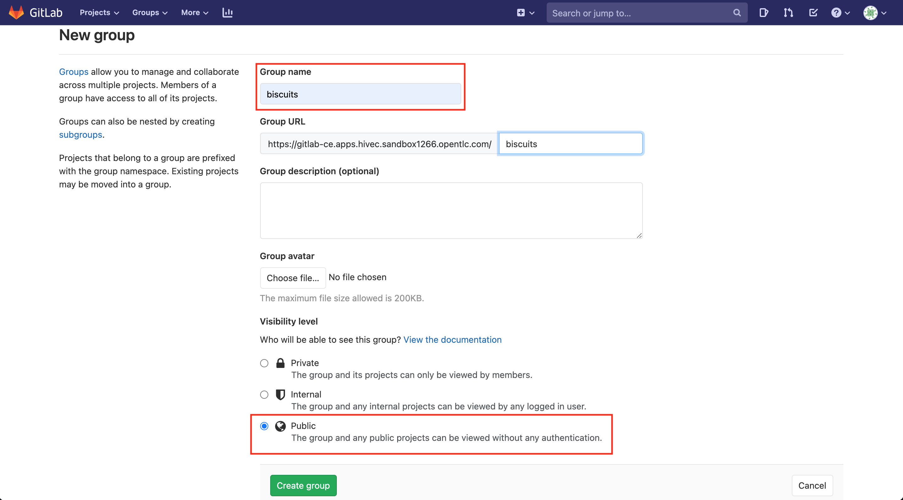

## 🐙 ArgoCD - GitOps Controller
Blah blah blah stuff GitOps and why we use it...

blah blah blah stuff about Operators and Helm and what they provide us.

## Get your GitLab ready for GitOps
Log into GitLab with your team with your credentials. We need to create a group in GitLab as <TEAM_NAME>.  Click "Create a group" on the screen:


Put your <TEAM_NAME> as the group name, select `Public` for Visibility level, and hit Create group. 


Now lets create a git repository that we are going to use for <span style="color:purple;" >GIT</span>Ops purposes :)

From `New Project` button on the left hand side, and use `tech-exercise` as Project Name, select `Public` for Visibility level, and hit Create project. 


Now let's start our GitOps Journey!

## ArgoCD Basic install
ArgoCD is one of the most popular GitOps tools to keep the entire state of our OpenShift clusters as described in our git repos. ArgoCD is deployed as an 


1. W
```bash
helm repo add redhat-cop https://redhat-cop.github.io/helm-charts
```

A basic install of ArgoCD
```bash
helm upgrade --install argocd \
  --namespace ${TEAM_NAME}-ci-cd \
  --set namespace=${TEAM_NAME}-ci-cd \
  --set argocd_cr.applicationInstanceLabelKey=rht-labs.com/${TEAM_NAME} \
  redhat-cop/argocd-operator
```

```bash
oc get pods -w -n ${TEAM_NAME}-ci-cd
```

can login and check _nothing is deployed_

Login and show empty UI

### ArgoCD - Add Repositories at runtime

Post deployment, ArgoCD manages Repositories in a ConfigMap ```oc get cm argocd-cm -o yaml```

We can add `Git|Helm` repositories via `ssh|https`.

Lets add our GitLab repo.

```bash
export GITLAB_USER=<your gitlab user>
export GITLAB_PASSWORD=<your gitlab password>
```

Lets put our git credentials via a Kubernetes secret for now. **We will fix this with a Sealed Secrets in a later exercise**
```bash
cat <<EOF | oc apply -f -
apiVersion: v1
data:
  password: "$(printf ${GITLAB_PASSWORD} | base64 -w0)"
  username: "$(printf ${GITLAB_USER} | base64 -w0)"
kind: Secret
metadata:
  annotaion:
    tekton.dev/git-0: https://gitlab-ce
  labels:
    credential.sync.jenkins.openshift.io: "true"
  name: git-auth
EOF
```

Patch the repository list, be sure to use your `GITLAB_URL`
```bash
oc -n ${TEAM_NAME}-ci-cd patch cm argocd-cm --patch "
data:
  repositories: |
    - name: ubiquitous-journey
      url: https://github.com/rht-labs/ubiquitous-journey.git
    - name: redhat-cop
      type: helm
      url: https://redhat-cop.github.io/helm-charts
    - url: https://gitlab-ce.do500-gitlab.${CLUSTER_DOMAIN}/${TEAM_NAME}/tech-excercise.git
      type: git
      insecure: false
      insecureIgnoreHostKey: true
      passwordSecret:
        key: password
        name: git-auth
      usernameSecret:
        key: username
        name: git-auth
"
```

### ArgoCD - Add Repositories at install time

**Going the Extra Mile**

We can also add repositories at install time, be sure to use your `GITLAB_URL`.

```bash
export GITLAB_USER=<your gitlab user>
export GITLAB_PASSWORD=<your gitlab password>
```

Lets our git creds via a secret (**UJ this**)
```bash
cat <<EOF | oc apply -n ${TEAM_NAME}-ci-cd -f -
apiVersion: v1
data:
  password: "$(printf ${GITLAB_PASSWORD} | base64 -w0)"
  username: "$(printf ${GITLAB_USER} | base64 -w0)"
kind: Secret
metadata:
  annotaion:
    tekton.dev/git-0: https://gitlab-ce
  labels:
    credential.sync.jenkins.openshift.io: "true"
  name: git-auth
type: kubernetes.io/basic-auth
EOF
```


Create our configuration, be sure to use your `GITLAB_URL`.
```bash
cat <<'EOF' > /tmp/initial-repos.yaml
- name: ubiquitous-journey
  url: https://github.com/rht-labs/ubiquitous-journey.git
- name: redhat-cop
  type: helm
  url: https://redhat-cop.github.io/helm-charts
- name: do500-git
  url: https://gitlab-ce.do500-gitlab.${CLUSTER_DOMAIN}/${TEAM_NAME}/tech-excercise.git
  type: git
  insecure: true
  insecureIgnoreHostKey: true
  passwordSecret:
    name: git-auth
    key: password
  usernameSecret:
    name: git-auth
    key: username
EOF

cat <<'EOF' > /tmp/initial-creds.yaml
- name: git-auth
  passwordSecret:
    name: git-auth
    key: password
  usernameSecret:
    name: git-auth
    key: username
  type: git
  url: https://gitlab-ce.do500-gitlab.${CLUSTER_DOMAIN}
EOF
```

Reinstall ArgoCD using new initial settings:
```bash
helm upgrade --install argocd \
  --namespace ${TEAM_NAME}-ci-cd \
  --set namespace=${TEAM_NAME}-ci-cd \
  --set argocd_cr.applicationInstanceLabelKey=rht-labs.com/${TEAM_NAME} \
  --set argocd_cr.initialRepositories="$(cat /tmp/initial-repos.yaml)" \
  --set argocd_cr.repositoryCredentials="$(cat /tmp/initial-creds.yaml)" \
  redhat-cop/argocd-operator
```

### Deploy A Microsite via ArgoCD (into new namespace?)

^ this is all well and good, but we want to do GIT OPS !
