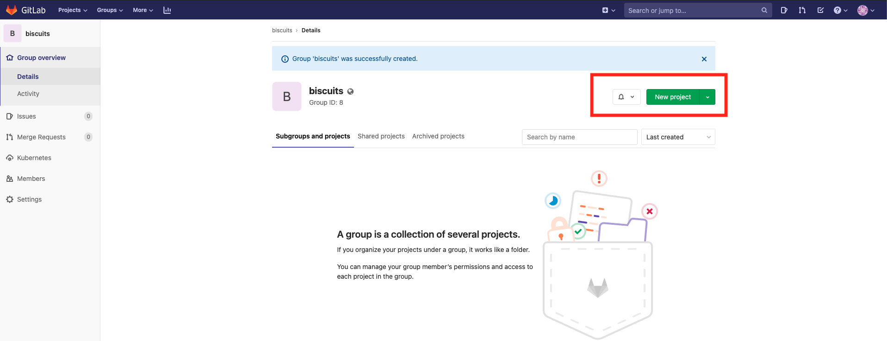
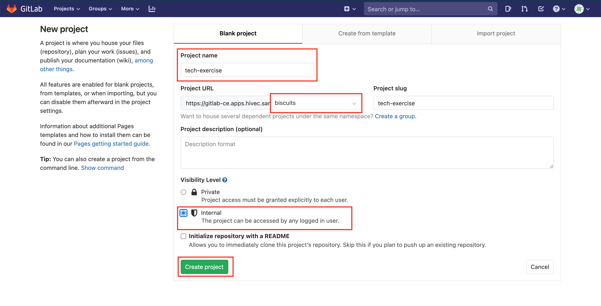

## 🔥🦄 Ubiquitous Journey
blah blah what it is, why we use it
Extensible, traceable, auditable ...
### Get GitLab Ready for GitOps
> In this exercise we'll setup our git project to store our code and configuration. We will then connect argocd (out gitOps controller) to this git repository to enable the GitOps workflow. Tooling will be shared by all members of your team, so do this exercise as a mob!
 
1. Log into GitLab with one of your credentials. We need to create a group in GitLab as <TEAM_NAME>.  Click "Create a group" on the screen:


2. Put your <TEAM_NAME> as the group name, select `Public` for Visibility level, and hit Create group. This is so we can easily share code and view other teams' activity.


3. Now lets create the git repository that we are going to use for <span style="color:purple;" >GIT</span>Ops purposes The `tech-exercise` will serve as a mono-repo holding both our tooling configuration and the application definitions. Hit `Create a project` button on the left hand side

 
4. On the new view, use `tech-exercise` as Project Name, select `Public` for Visibility level, then hit Create project. Make sure the project is in the group you created previously and not the username's.



5. Back in your CodeReady Workspace, open a terminal if you have not got one open. Let's push our code to the GitLab server
```bash
cd /projects/tech-excercise
```
```bash
git remote set-url origin https://gitlab-ce.do500-gitlab.apps.${CLUSTER_DOMAIN}/${TEAM_NAME}/tech-excercise.git
```
```bash
git push -u origin --all
```

With our git project created, let's start our GitOps Journey 🧙‍♀️🦄!

### Take a walk in values.yaml file... [pb enabled false]

Take a walk in values-tooling.yaml file...
* Boostrap projects 
* Jenkins
* Tekton

Update your `values.yaml`
- update  the `source` URL to be your `GITHUB_URL`
- change your `<TEAM_NAME>` in the bootstrap section
```bash
source: source: "https://gitlab-ce.do500-gitlab.<CLUSTER_DOMAIN>/<TEAM_NAME>/tech-exercise.git"
team: <TEAM_NAME>
```

Update your `ubiquitous-journey/values-tooling.yaml`
- change your `<TEAM_NAME>` in the bootstrap section
```yaml
        - name: jenkins
          kind: ServiceAccount
          role: admin
          namespace: <TEAM_NAME>-ci-cd
      namespaces:
        - name: <TEAM_NAME>-ci-cd
          bindings: *binds
        - name: <TEAM_NAME>-dev
          bindings: *binds
        - name: <TEAM_NAME>-test
          bindings: *binds
        - name: <TEAM_NAME>-stage
          bindings: *binds
```
- update  the `source` URL to be your `GITHUB_URL`
```yaml
  # Tekton Pipelines
  - name: tekton-pipeline
    enabled: true
    source: "https://gitlab-ce.do500-gitlab.<CLUSTER_DOMAIN>/<TEAM_NAME>/tech-exercise.git"
    source_ref: main
    source_path: tekton
    values:
      team: <TEAM_NAME>
```

```bash
# git add, commit, push your changes..
git add .
git commit -m  "🦆 ADD - correct project names 🦆" 
git push 
```

Install all the tooling in UJ (only bootstrap, and Jenkins at this stage..)
```bash
helm upgrade --install uj --namespace ${TEAM_NAME}-ci-cd .
```
show namespaces & Jenkins spinning up via ArgoCD 

Show resources in the cluster
```bash
oc get projects | grep ${TEAM_NAME}
```
```bash
oc get pods -n ${TEAM_NAME}-ci-cd
```

TODO - fix bootstrap for dummy-sa (sort of did at the time being)