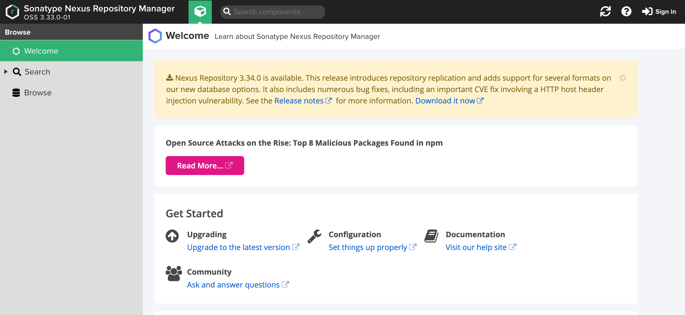

## Extend UJ with a another tool, eg Nexus 
Now, we have our projects, necessary rolebindings and Jenkins up and running. We also need a repository to manage and store our artifacts. Nexus is here to help! We can use Nexus helm chart to deploy it. And since this is GitOps, all we need to do is extend UJ! Because if it is not in Git, it's not REAL! ;)

#### Add Nexus in our tool box
> In this exercise we'll add Sonatype's Nexus repository manager to our tooling - this tool will be used to host our application binaries!

1. Update your `ubiquitous-journey/values-tooling.yaml` to include Nexus with some sensible defaults. In this example we're just pointing our ArgoCD config to a helm chart. Add the following into the file under the `# Nexus` placeholder

    ```yaml
      # Nexus
      - name: nexus
        enabled: true
        source: https://redhat-cop.github.io/helm-charts
        chart_name: sonatype-nexus
        source_ref: "1.1.0"
        values:
          service:
            name: nexus
    ```

2. Now push the changes into your git repository for it to be automatically rolled out by ArgoCD!

    ```bash
    git add .
    git commit -m  "🦘 ADD - nexus repo manager 🦘"
    git push 
    ```

3. ArgoCD will detect the change in `ubiquitous-journey/values-tooling.yaml` and deploy Nexus on our behalf in order to match what is in git also in the cluster. You can see it also in ArgoCD UI.


4. It can take a few minutes to become available. But you can verify it is all working by opening the Nexus URL in a new tab:

    ```bash
    echo https://$(oc get route nexus --template='{{ .spec.host }}' -n ${TEAM_NAME}-ci-cd)
    ```
    

#### Add ArgoCD Webhook from GitLab
> ArgoCD has a cycle time of about 3ish mins - this is too slow for us, so we can make argocd sync our changes AS SOON AS things hit the git repo. 

1. Let's add a webhook to connect ArgoCD to our `ubiquitous-journey` project. Get ArgoCD URL with following:

    ```bash
    echo https://$(oc get route argocd-server --template='{{ .spec.host }}'/api/webhook  -n ${TEAM_NAME}-ci-cd)
    ```

2. Go to `tech-exercise` git repository on GitLab. From left panel, go to `Settings > Integrations` and add the URL you just copied from your terminal to enable the WebHook. Now whenever a change is made in Git, ArgoCD will instantly reconcile and apply the differences between the current state in the cluster and the desired state in git 🪄. Make sure you **untick** `Enable SSL verification` and then click `Add webhook`.

