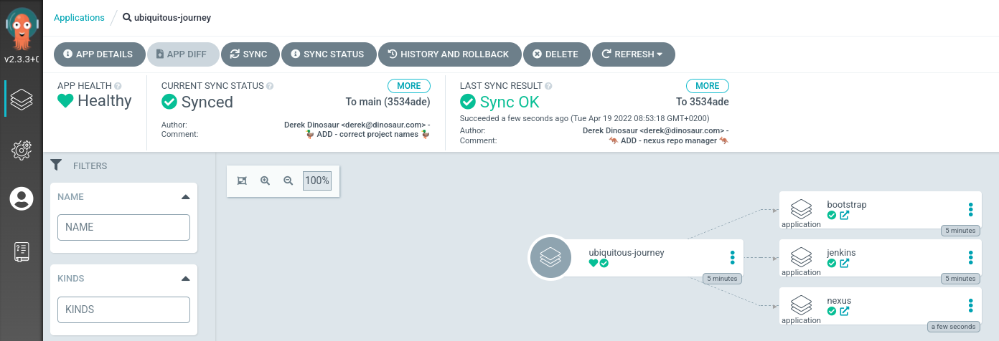
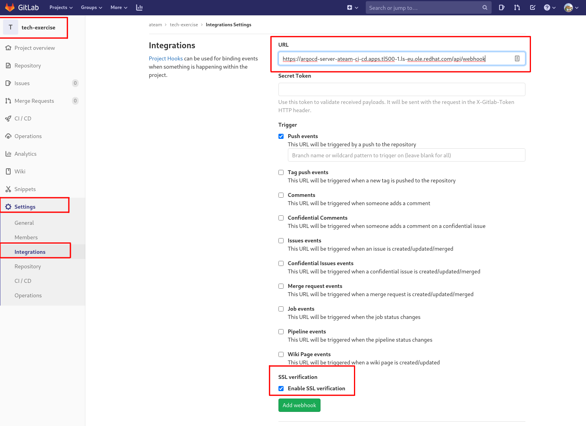

## Extend UJ with a another tool, eg Nexus 
Now, we have our projects, necessary rolebindings and Jenkins up and running. We also need a repository to manage and store our artifacts. Nexus is here to help! We can use Nexus helm chart to deploy it. And since this is GitOps, all we need to do is extend UJ! Because if it is not in Git, it's not REAL! ;)

#### Add Nexus in our tool box
> Add sonatype's Nexus repository manager to our tooling!

1. Update your `ubiquitous-journey/values-tooling.yaml` to include Nexus with some sensible defaults. Copy the following into the file:
```yaml
  # Nexus
  - name: nexus
    enabled: true
    source: https://redhat-cop.github.io/helm-charts
    chart_name: sonatype-nexus
    source_ref: "1.0.0"
    values:
      service:
        name: nexus
```

2. Now push the changes into your git repository!
```bash
git add .
git commit -m  "🦘 ADD - nexus repo manager 🦘" 
git push 
```

3. ArgoCD will detect the change in `values-tooling.yaml` and deploy Nexus on our behalf in order to match what is in git also in the cluster. You can see it also in ArgoCD UI.


4. It can take a few minutes to become available. You can verify it by opening the Nexus URL in a new tab:
```bash
oc get route nexus --template='{{ .spec.host }}' -n ${TEAM_NAME}-ci-cd
```

#### Add ArgoCD Webhook from GitLab
> ArgoCD has a cycle time of about 5ish mins - this is too slow for us, so we can make argocd sync our changes AS SOON AS things hit the git repo. 

1. Let's add a webhook to connect ArgoCD to our ubiquitous-journey project.


2. Go to `tech-exercise` git repository in UI. From left panel, go to `Settings > Integrations`. Add URL:
```bash
echo https://$(oc get route argocd-server --template='{{ .spec.host }}'/api/webhook)
```
Make sure you untick `Enable SSL verification` and then click `Add webhook`.