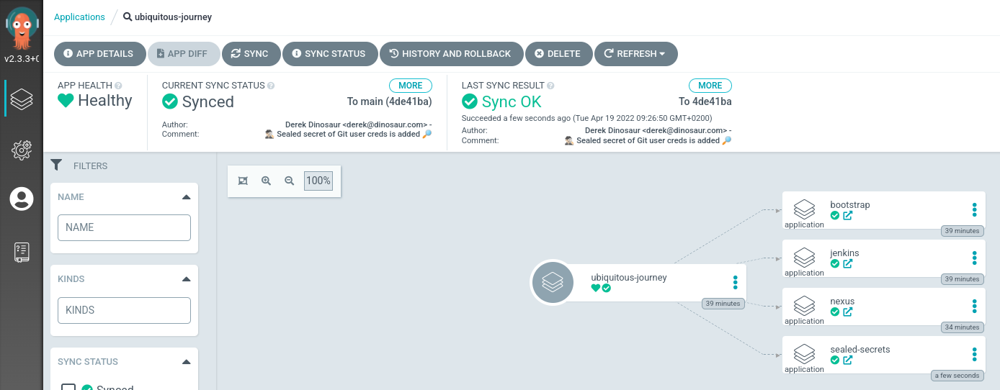

# Sealed Secrets
When we say GitOps, we say _"if it's not in Git, it's NOT REAL"_ but how are we going to store our sensitive data like credentials in Git repositories, where many people can access?! Sure, Kubernetes provides a way to manage secrets, but the problem is that it stores the sensitive information as a base64 string - anyone can decode the base64 string! Therefore, we cannot store `Secret` manifest files openly. We use an open-source tool called Sealed Secrets to address this problem.

Sealed Secrets allows us to _seal_ Kubernetes secrets by using a utility called `kubeseal`. The `SealedSecrets` are Kubernetes resources that contain encrypted `Secret` object that only the controller can decrypt. Therefore, a `SealedSecret` is safe to store even in a public repository.

## Sealed Secrets in action

1. The observant among you will have noticed that in the previous exercise we created a secret for git and added it to the cluster WITHOUT putting it in git...😳 Lets start by fixing this and sealing our Git credentials so they can be safely checked in to the code. First, we'll create the secret in a tmp directory. Replace `<YOUR_GITLAB_USER>` and `<YOUR_GITLAB_PASSWORD>` accordingly if not already set in your environment:

    ```bash
    export GITLAB_USER=<YOUR_GITLAB_USER>
    ```

    ```bash
    export GITLAB_PASSWORD=<YOUR_GITLAB_PASSWORD>
    ```

2. Run this command to generate a Kubernetes secret object in `/tmp` with the right labels needed for Tekton and Jenkins later.

    ```bash
    cat << EOF > /tmp/git-auth.yaml
    kind: Secret
    apiVersion: v1
    data:
      username: "$(printf ${GITLAB_USER} | base64 -w0)"
      password: "$(printf ${GITLAB_PASSWORD} | base64 -w0)"
    metadata:
      annotation:
        tekton.dev/git-0: https://gitlab-ce.${CLUSTER_DOMAIN}
      labels:
        credential.sync.jenkins.openshift.io: "true"
      name: git-auth
    EOF
    ```

3. Use `kubeseal` command line to seal the secret definition. This will encrypt it using a certificate stored in the controller running inside the cluster. This has already been deployed for you as only one instance can exist per cluster.

    ```bash
    kubeseal < /tmp/git-auth.yaml > /tmp/sealed-git-auth.yaml \
        -n ${TEAM_NAME}-ci-cd \
        --controller-namespace do500-shared \
        --controller-name sealed-secrets \
        -o yaml
    ```

4. Verify that secret is sealed:

    ```bash
    cat /tmp/sealed-git-auth.yaml 
    ```

    We should now see the secret is sealed, so it is safe for us to store in our repository. It should look something a bit like this, but with longer password and username output.

    <div class="highlight" style="background: #f7f7f7">
    <pre><code class="language-yaml">
    apiVersion: bitnami.com/v1alpha1
    kind: SealedSecret
    metadata:
      creationTimestamp: null
      name: git-auth
      namespace: biscuits-ci-cd
    spec:
      encryptedData:
        username: AgAtnYz8U0AqIIaqYrj...
        password: AgAj3JQj+EP23pnzu...
    ...
    </code></pre></div>

5. We want to grab the results of this sealing activity, in particular the `encryptedData` so we can add it to git. We have already written a [helper helm chart](https://github.com/redhat-cop/helm-charts/tree/master/charts/helper-sealed-secrets) that can be used to add sealed secrets to our cluster in repeatable way. We'll provide the `encryptedData` values to this chart in the next step.

    ```bash
    cat /tmp/sealed-git-auth.yaml | grep -E 'username|password'
    ```

    <div class="highlight" style="background: #f7f7f7">
    <pre><code class="language-yaml">
        username: AgAtnYz8U0AqIIaqYrj...
        password: AgAj3JQj+EP23pnzu...
    </code></pre></div>

6. In `ubiquitous-journey/values-tooling.yaml` add an entry for this helper chart under `# Sealed Secrets`. Copy the output of `username` and `password` from the previous command and update the values accordingly. **Make sure you indent the data correctly**.

    ```yaml
      # Sealed Secrets
      - name: sealed-secrets
        enabled: true
        source: https://redhat-cop.github.io/helm-charts
        chart_name: helper-sealed-secrets
        source_ref: "1.0.2"
        values:
          secrets:
            # Additional secrets will be added to this list along the exercises.
            - name: git-auth
              type: kubernetes.io/basic-auth
              annotations:
                tekton.dev/git-0: https://gitlab-ce.<CLUSTER_DOMAIN>
              labels:
                credential.sync.jenkins.openshift.io: "true"
              data:
                username: <YOUR_SEALED_SECRET_USERNAME>
                password: <YOUR_SEALED_SECRET_PASSWORD>
    ```

7. Now that we update the file, we need to push the changes to our repository for ArgoCD to detect the update. Because it is GitOps :)

    ```bash
    git add ubiquitous-journey/values-tooling.yaml
    git commit -m "🕵🏻‍♂️ Sealed secret of Git user creds is added 🔎"
    git push
    ```

    🪄 🪄 Log in to ArgoCD - you should now see the SealedSecret chart in ArgoCD UI. It is attempting to unsealed as a regular k8s secret 🪄 🪄
    

8. If you drill into the `SealedSecret` on ArgoCD's UI - you'll might notice that the `git-auth` secrets fails to sync:
    

    <p class="tip">HEALTH DETAILS - failed update: Resource <b>"git-auth"</b> already exists and is not managed by SealedSecret</p>

    Thats because we already created a `git-auth` secret manually in Excercise 1. Lets remove it now and resync ArgoCD:

    ```bash
    oc -n ${TEAM_NAME}-ci-cd delete secret/git-auth
    ```

9. You may need to force sync your secret in argocd to get it to apply:


    🪄 You can verify it's been synced to Jenkins now by opening `Jenkins -> Configuration -> Credentials` to view `<TEAM_NAME>-ci-cd-git-auth` credential is there

    ```bash
    echo https://$(oc get route jenkins --template='{{ .spec.host }}' -n ${TEAM_NAME}-ci-cd)
    ```

    
