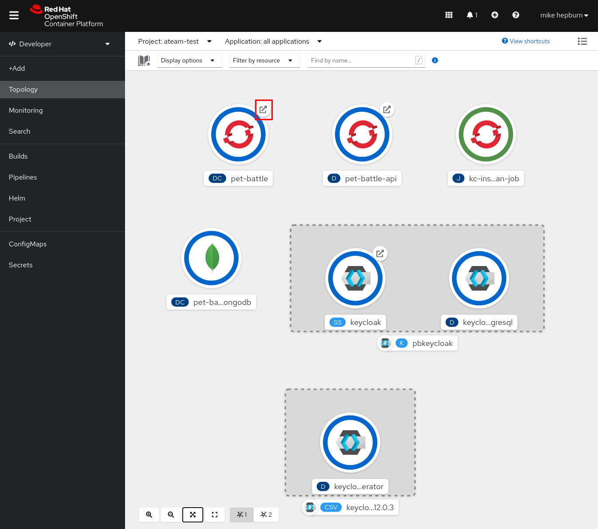

## Deploy App of Apps

We need a way to bundle up all of our applications and deploy them into each environment. Each PetBattle application has its own Git repository and Helm chart, making it easier to code and deploy independently from other apps.

A developer can get the same experience and end result installing an application chart using `helm install` as our fully automated pipeline. This is important from a useability perspective. Argo CD has great support for all sorts of packaging formats that suit Kubernetes deployments, `Kustomize`, `Helm`, as well as just raw YAML files. Because Helm is a template language, we can mutate the Helm chart templates and their generated Kubernetes objects with various values allowing us to configure them with configuration per environment.

We deploy each of our applications using an Argo CD `application` definition. We use one Argo CD `application` definition for every environment in which we wish to deploy the application. We make use of Argo CD `app of apps pattern` to bundle all of these all up; some might call this an application suite or a system! In PetBattle we generate the app-of-apps definitions using a Helm chart.

### Deploying Pet Battle - Keycloak

> In this exercise we'll deploy PetBattle and a supporing piece of tech it uses (Keycloak) using the same pattern. We'll deploy PetBattle to two environments - `test` and `stage` by configuring the values files in `pet-battle/stage/values.yaml` && `pet-battle/test/values.yaml`

1. In your IDE - open `values.yaml` file at the root of this project and **swap** `enabled: false` to `enabled: true` as shown below for each of the app-of-pb definitions:

    <div class="highlight" style="background: #f7f7f7">
    <pre><code class="language-yaml">
      # Test app of app
      - name: test-app-of-pb
        enabled: true
        source_path: "."
        helm_values:
          - pet-battle/test/values.yaml
      # Staging App of Apps
      - name: staging-app-of-pb
        enabled: true
        source_path: "."
        helm_values:
          - pet-battle/stage/values.yaml
    </code></pre></div>

2. Our app is made up of N apps. We define the list of apps we want to deploy in the `applications` property in our `pet-battle/test/values.yaml`. Let's add a keycloak service to this list by appending to it as follows. This will take the helm-chart from the repo and apply the additional configuration to it from the `values` section. *Please make sure your text is aligned with the existing placeholder comments.*

    ```yaml
      # Keycloak
      keycloak:
        name: keycloak
        enabled: true
        source: https://github.com/petbattle/pet-battle-infra
        source_ref: main
        source_path: keycloak
        values:
          app_domain: <CLUSTER_DOMAIN>
    ```

3. Let's get this deployed of course - it's not real unless its in git!

    ```bash
    # git add, commit, push your changes..
    git add .
    git commit -m  "🐰 ADD - app-of-apps and keycloak to test 🐰"
    git push 
    ```

4. With the values enabled, and the first application listed in the test environment - let's tell ArgoCD to start picking up changes to these environments. To do this, simply update the helm chart we installed at the beginning of the first exercise:

    ```bash
    helm upgrade --install uj --namespace ${TEAM_NAME}-ci-cd .
    ```

5. In ArgoCD at this point we should see things start to get a bit more busy:


### Deploying Pet Battle
> Now that the infra for PetBattle is up and running, let's deploy PetBattle itself. Each environment folder (test / stage) contains the configuration for the corresponding projects in OpenShift. All we need to do is extend or edit the list of `applications` for the changes to be synced to the cluster. We can also separate test environment config from staging or even prod using this method.

1. In your IDE, open up the `pet-battle/test/values.yaml` file and copy the following:

    ```yaml
      # Pet Battle Apps
      pet-battle-api:
        name: pet-battle-api
        enabled: true
        source: https://petbattle.github.io/helm-charts  # http://nexus:8081/repository/helm-charts
        chart_name: pet-battle-api
        source_ref: 1.1.0 # helm chart version
        values:
          image_name: pet-battle-api
          image_version: latest # container image version

      pet-battle:
        name: pet-battle
        enabled: true
        source: https://petbattle.github.io/helm-charts  # http://nexus:8081/repository/helm-charts 
        chart_name: pet-battle
        source_ref: 1.0.6 # helm chart version
        values:
          image_version: latest # container image version
    ```

2. The front end needs to have some configuration applied to it. This could be packaged up in the helm chart or baked into the image - BUT we should really apply configuration as *code*. We should build our apps once so they can be initialized in many environments with configuration supplied at runtime. For the Frontend, this means supplying the information to where the API live. We use ArgoCD to manage our application deployments, so hence we should update the values supplied to this chart as such.

    ```bash
    cat << EOF >> pet-battle/test/values.yaml
          config_map: '{
            "catsUrl": "https://pet-battle-api-${TEAM_NAME}-test.${CLUSTER_DOMAIN}",
            "tournamentsUrl": "https://pet-battle-tournament-${TEAM_NAME}-test.${CLUSTER_DOMAIN}",
            "matomoUrl": "https://matomo-${TEAM_NAME}-ci-cd.${CLUSTER_DOMAIN}/",
            "keycloak": {
              "url": "https://keycloak-${TEAM_NAME}-test.${CLUSTER_DOMAIN}/auth/",
              "realm": "pbrealm",
              "clientId": "pbclient",
              "redirectUri": "http://localhost:4200/tournament",
              "enableLogging": true
            }
          }'
    EOF
    ```

3. The `pet-battle/test/values.yaml` file should now look something like this (but with your team name and domain)

    ```yaml
      # Pet Battle Frontend
      pet-battle:
        name: pet-battle
        enabled: true
        source: https://github.com/petbattle/pet-battle-infra.git
        source_ref: 1.0.0 # helm chart version
        values:
          image_version: latest # container image version
          config_map: '{
            "catsUrl": "https://pet-battle-api-<TEAM_NAME>-test.<CLUSTER_DOMAIN>",
            "tournamentsUrl": "https://pet-battle-tournament-<TEAM_NAME>-test.<CLUSTER_DOMAIN>",
            "matomoUrl": "https://matomo-<TEAM_NAME>-ci-cd.<CLUSTER_DOMAIN>/",
            "keycloak": {
              "url": "https://keycloak-<TEAM_NAME>-test.<CLUSTER_DOMAIN>/auth/",
              "realm": "pbrealm",
              "clientId": "pbclient",
              "redirectUri": "http://localhost:4200/tournament",
              "enableLogging": true
            }
          }'
    ```

4. Repeat the same thing for `pet-battle/stage/values.yaml` file (update the `<TEAM_NAME>-test` to be `<TEAM_NAME>-stage` for the Frontend configuration) in order to deploy the staging environment, and push your changes to the repo. _Its not real unless its in git_

    ```bash
    git add .
    git commit -m  "🐩 ADD - pet battle apps 🐩"
    git push 
    ```

5. You should see the two Pet Battle apps for `test` and `stage` deployed in ArgoCD and if you drill into one eg `test-app-of-pb` you'll see each of the three components of PetBattle:


6. Finally - let's see if the whole thing in working. Go to OpenShift -> Developer View -> Topology and select your `<TEAM_NAME>-test` project.
    </br>
    🪄 🪄 You should be able to see the Pet Battle Applications running. 🪄 🪄

    

    </br>
    😻😻 Select the Pet Battle URL link highlighted above and you should see ... 😻😻

    
