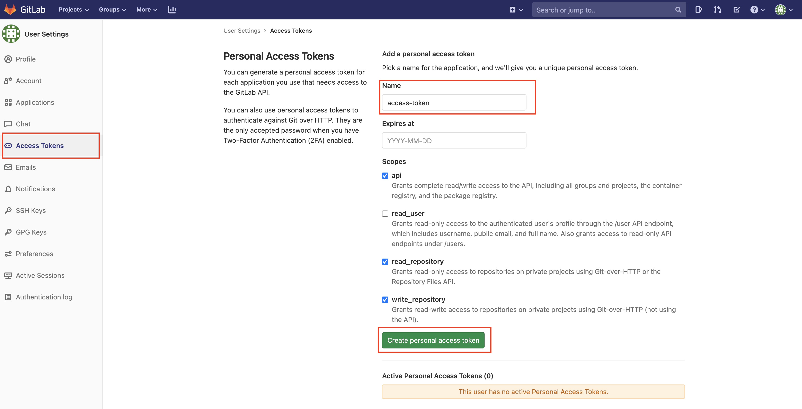
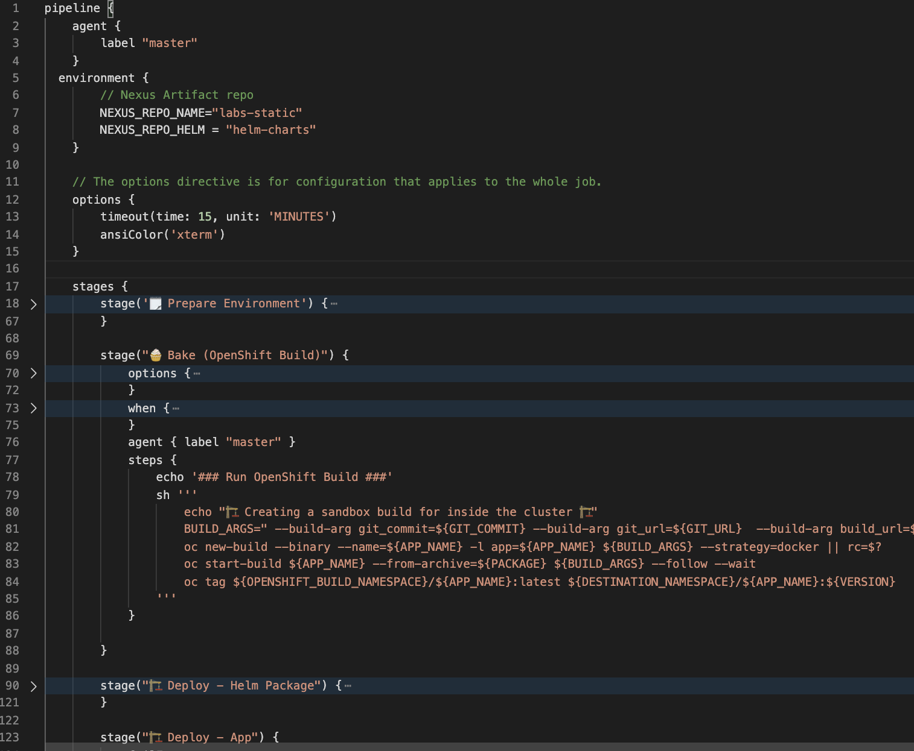

### Jenkins Pipeline 
> Jenkins is tool that's been around for sometime but it's stuck with a lot of customers. It's a build server that's pretty dumb by nature but can be enhanced with lots of plugins and agents which is why it's such a powerful tool. 

<!---
#### Jenkins access to GitLab
Jenkins needs to access repositories to see Jenkinsfile. There are multiple options to use ie username/password, SSH Keys and token (which we will going to use)

1. Login to GitLab and click on your avatar from upper left corner > Settings.

2. Click on Access Token and generate one.

3. Copy the newly generated token and update `ubiquitous-journey/values-tooling.yaml`


```bash
...
...
          - name: GITLAB_TOKEN
            value: ''
...
```

```bash
git add ubiquitous-journey/values-tooling.yaml
git commit -m "🥔 Gitlab Token is added 🥔"
git push
```
--->

#### Setup Pet Battle (front end) Git Repo
1. Open the GitLab UI. Create a repo in GitLab under `<TEAM_NAME>` group called `pet-battle`. Make the project as **public**.


2. Back in your CodeReady Workspace, we'll fork the PetBattle Frontend code to this newly created repository on git.

```bash
cd /projects
git clone https://github.com/rht-labs/pet-battle.git && cd pet-battle
git remote set-url origin https://gitlab-ce.${CLUSTER_DOMAIN}/${TEAM_NAME}/pet-battle.git
git branch -M main
git push -u origin main
```

3. We want to be able to tell Jenkins to run a build for every code change - welcome our good ol' friend the Webhook. Just like we did with ArgoCD earlier, let's add a webhook to GitLab for our Pet Battle front end so every commit triggers it. Jenkins needs a url of the form `<JENKINS_URL>/multibranch-webhook-trigger/invoke?token=<APP_NAME>` to trigger a build:

```bash
echo "\n https://$(oc get route jenkins --template='{{ .spec.host }}' -n ${TEAM_NAME}-ci-cd)/multibranch-webhook-trigger/invoke?token=pet-battle"
```
Once you have the URL, over on GitLab go to `pet-battle > Settings > Integrations` to add the webhook 


#### Jenkins Pipeline
> Jenkins is preloaded with a simple job called a `seed-multibranch-pipeline`. This is a small bit of groovy scripting that will automatically scaffold out our piplines from each repositories `Jenkinsfile`. The logic of this script is simple, it checks a group for a given GitLab instance for any projects that contain Jenkinsfile. If it finds one, it will scaffold a pipleine from it, and it not, it will skip.

1. To get the `seed-multibranch-pipeline` job to work we simply have to connect Jenkins to GitLab by exposing some variables on the deployment for it... we could of course just add them to the deployment in openshift BUTTTTTT this is GITOPS! :muscle: :gun:
update the `ubiquitous-journey/values-tooling.yaml` Jenkins block / values 

```yaml
      #... more jenkins configuration here
      deployment:
        env_vars:
          - name: GITLAB_DEFAULT_BRANCH
            value: 'main'
          - name: GITLAB_HOST
            value: 'https://gitlab-ce.<CLUSTER_DOMAIN>'
          - name: GITLAB_GROUP_NAME
            value: '<TEAM_NAME>'
          - name: BISCUITS
            value: 'jaffa-cakes🍪'
```

2. Jenkins will push changes to our Helm Chart to Nexus as part of the pipeline. Previously we configured our App of Apps to pull from the PetBattle public chart repository so we also need to update it. Change the `pet-battle/test/values.yaml` file to point to the Nexus chart repository deployed in OpenShift. To do this, update the `source` as shown below for the `pet-battle-api`:

<pre>
  # Pet Battle Apps
  pet-battle-api:
    ...
  pet-battle:
    name: pet-battle
    enabled: true
    source: <strong>http://nexus:8081/repository/helm-charts</strong>
    source_ref: 1.0.6 # helm chart version
    ...
</pre>

3. Commit these changes to git so ArgoCD can sync them.
```bash
cd /projects/tech-exercise
git add .
git commit -m  "🍕 ADD - jenkins pipelines config 🍕" 
git push
```

4. When this change rolls out we should see the seed job has scaffolded out a pipleine for the frontend in the Jenkins UI. It's done this by looking in the pet-battle repo where it found the `Jenkinsfile` (our pipeline's definition). However it will fail on the first execution, this is expected as we're going write some stuff to fix it ...
```bash
# to get the Jenkins route on your terminal
echo https://$(oc get route jenkins --template='{{ .spec.host }}' -n ${TEAM_NAME}-ci-cd)
```

_^✋ INFO - If after Jenkins restarts you do not see the job run, feel free to manually trigger it to get it going_


5. With Jenkins now scanning our gitlab project for new repositories and git setup to trigger a build on jenkins, now let's explore our pipeline. A `Jenkinsfile` uses a DSL (Jenkins language) to declaratively describe the pipeline in a series of blocks. Ours is setup a lot like this :



Some of the key things to note above are:
   * `pipeline {}` is how all declarative Jenkins pipelines begin.
   * `environment {}` defines environment variables to be used across all build stages
   * `options {}` contains specific Job specs you want to run globally across the jobs e.g. setting the terminal colour
   * `stage {}` all jobs must have one stage. This is the logical part of the build that will be executed e.g. `bake-image`
   * `steps {}` each `stage` has one or more steps involved. These could be execute shell or git checkout etc.
   * `agent {}` specifies the node the build should be run on e.g. `jenkins-agent-npm`
   * `post {}` hook is used to specify the post-build-actions. Jenkins declarative pipeline syntax provides very useful callbacks for `success`, `failure` and `always` which are useful for controlling the job flow
   * `when {}` is used for flow control. It can be used at the stage level and be used to stop pipeline entering that stage. e.g. when branch is master; deploy to `test` environment.

1. Now that we've gone through what this stuff does, let's try fix the failing build. If you look at the output of the Jenkins job you'll see it's not able to find anythin in Nexus to put in a container. To fix this, update the `Jenkinsfile` by adding a new `stage` which will run app compilation, producing the artifact in Nexus for us. Add the following below the  `// 💥🔨 PIPELINE EXERCISE GOES HERE ` comment:

```groovy
        // 💥🔨 PIPELINE EXERCISE GOES HERE 
        stage("🧰 Build (Compile App)") {
            agent { label "jenkins-agent-npm" }
            steps {
                script {
                    env.VERSION = sh(returnStdout: true, script: "npm run version --silent").trim()
                    env.PACKAGE = "${APP_NAME}-${VERSION}.tar.gz"
                }
                sh 'printenv'

                echo '### Install deps ###'
                sh 'npm ci --registry http://nexus:8081/repository/labs-npm'

                // 💅 Lint exercise here
                echo '### Running Linting ###'

                // 🃏 Jest Testing
                echo '### Running Jest Testing ###'

                echo '### Running build ###'
                sh 'npm run build '

                // 🌞 SONARQUBE SCANNING EXERCISE GOES HERE 
                echo '### Running SonarQube ###'

                echo '### Packaging App for Nexus ###'
                sh '''
                    tar -zcvf ${PACKAGE} dist Dockerfile nginx.conf
                    curl -v -f -u ${NEXUS_CREDS} --upload-file ${PACKAGE} \
                        http://nexus:8081/repository/${NEXUS_REPO_NAME}/${APP_NAME}/${PACKAGE}
                '''
            }
        }
```

7. Push the changes to git

```bash
cd /projects/pet-battle
git add Jenkinsfile
git commit -m "🌸 Jenkinsfile updated with build stage 🌸"
git push
```

8. Back on Jenkins we should now see the pipeline running. If you swap to the Blue Ocean view, you get a lovely graph of  what it looks like in execution.


🪄OBSERVE PIPELINE RUNNING :D - At this point check in with the other half of the group and see if you've managed to integrate the apps🪄
