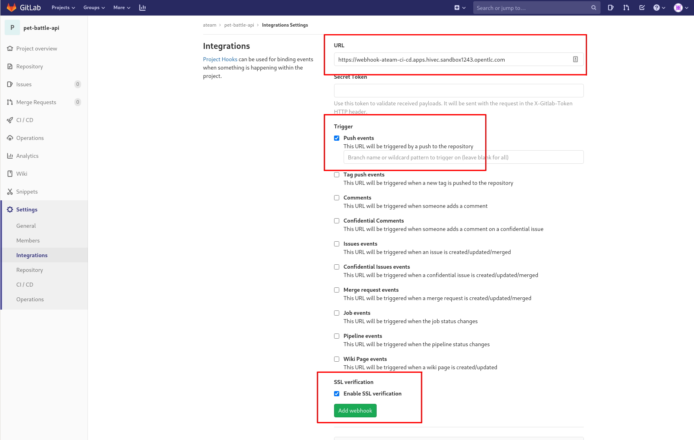
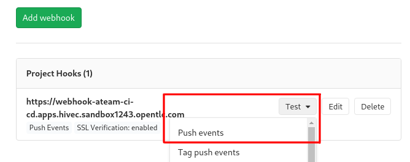

### Tekton Pipeline 
blah blah blah

- [TODO] Something something what is Tekton (and OpenShift Pipelines)
- [TODO] Explain what this Tekton pipeline is going to do
- [todo] - add TEkkers to the EF

#### Deploying the Tekton Objects

1. Create a repo in GitLab under `<YOUR_TEAM_NAME>` group called `pet-battle-api`. Then fork the PetBattle API.

```bash
cd /projects
git clone https://github.com/rht-labs/pet-battle-api.git && cd pet-battle-api
git remote set-url origin https://gitlab-ce.${CLUSTER_DOMAIN}/${TEAM_NAME}/pet-battle-api.git
git branch -M main
git push -u origin main
```

2. Edit `ubiquitous-journey/values-tooling.yaml` deploy Tekton Pipelines code. Remeber to replace the `CLUSTER_DOMAIN` and `TEAM_NAME` with your own.

```yaml
  # Tekton Pipelines
  - name: tekton-pipeline
    enabled: true
    source: "https://gitlab-ce.<CLUSTER_DOMAIN>/<TEAM_NAME>/tech-exercise.git"
    source_ref: main
    source_path: tekton
    values:
      team: <TEAM_NAME>
      cluster_domain: <CLUSTER_DOMAIN>
```

3. Update git
```bash
# git add, commit, push your changes..
cd /projects/tech-exercise
git add .
git commit -m  "🍕 ADD - tekton pipelines config 🍕" 
git push 
```

4. Add webhook to GitLab `pet-battle-project`
- fill in the `URL` based on this route
```bash
oc -n ${TEAM_NAME}-ci-cd get route webhook --template='{{ .spec.host }}'
```

- select `Push Events`, leve the branch empty for now
- select `SSL Verification`
- Click `Add webhook` button.

You can test the webhook works from GitLab.




>  You can enable debug log info for your tekton webhook pod by setting:
>```bash
> oc -n ${TEAM_NAME}-ci-cd edit cm config-logging-triggers
>```
> <pre>
> // set log level
> data:
>   loglevel.eventlistener: debug
> <pre>


5. Trigger pipeline via webhook by checking in some code for Pet Battle API. Lets change the application versions.

- Edit pet-battle-api `pom.xml` and update the `version` number
```xml
    <artifactId>pet-battle-api</artifactId>
    <version>1.1.2</version>
```
- Edit pet-battle-api `chart/Chart.yaml` and update the `version` and `appVersion` numbers
```yaml
version: 1.1.2
appVersion: 1.1.2
```

Update git
```bash
# git add, commit, push your changes..
cd /projects/pet-battle-api
git add .
git commit -m  "🍕 UPDATED - pet-battle-version to 1.1.2 🍕" 
git push 
```


🪄 OBSERVE PIPELINE RUNNING :D 

#### TODO

- [ ] sync is slow .. should we do the ArgoCD webhook?
- [ ] maven versions - consider using this and only update version in pom.xml
```bash
VERSION=$(mvn -s $(workspaces.maven-settings.path)/settings.xml help:evaluate -Dexpression=project.version -q -DforceStdout)
```
- [ ] figure out the tekton annotation !! and mounting git-auth