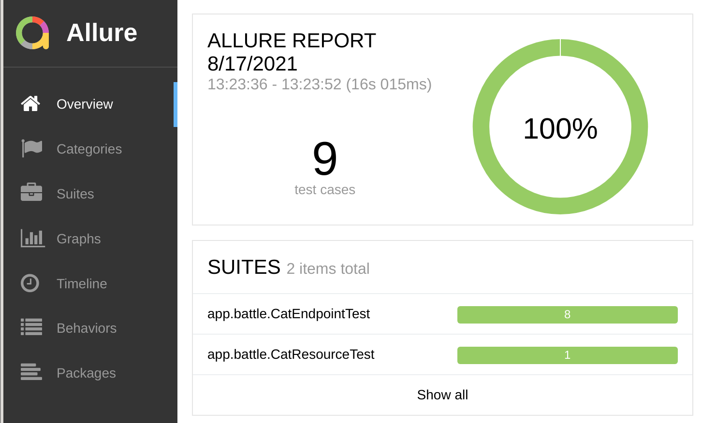
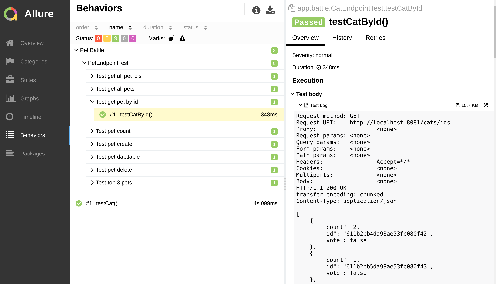

### Extend Jenkins Pipeline with Automated Testing

1. As a first step, let's add Allure credentials to Jenkinsfile. Add the followings to the beginning of the file in `environment` block.

```groovy
		ALLURE_CREDS = credentials("${OPENSHIFT_BUILD_NAMESPACE}-allure-auth")
```
You'll have:

<pre>
		<span style="color:green;" >// Credentials bound in OpenShift</span>
		GIT_CREDS = credentials(<span style="color:orange;" >"</span>${OPENSHIFT_BUILD_NAMESPACE}<span style="color:orange;" >-git-auth"</span>)
		NEXUS_CREDS = credentials(<span style="color:orange;" >"</span>${OPENSHIFT_BUILD_NAMESPACE}<span style="color:orange;" >-nexus-password"</span>)
		ALLURE_CREDS = credentials(<span style="color:orange;" >"</span>${OPENSHIFT_BUILD_NAMESPACE}<span style="color:orange;" >-allure-auth"</span>)
</pre>

And add a stage in to the pipeline where <span style="color:green;" >// ALLURE TESTING REPORT</span> placeholder is. This needs to be happen before the build.

```groovy
        // 📜 ALLURE TESTING REPORT
		stage("📜 Allure test results") {
			agent { label "master" }
            when {
				expression { GIT_BRANCH.startsWith("master") || GIT_BRANCH.startsWith("main") }
			}
			steps {
				script {
                    sh '''
					    curl -sLo send_results.sh https://raw.githubusercontent.com/eformat/allure/main/scripts/send_results.sh && chmod 755 send_results.sh
                        ./send_results.sh ${APP_NAME} \
                        ${ALLURE_CREDS_USR} \
                        ${ALLURE_CREDS_PSW} \
                        "http://allure:5050"
                    '''
				}
			}
		}
```

3. Push the changes to the git repository, which also will trigger a new build.

```bash
cd /projects/pet-battle
git add Jenkinsfile
git commit -m "🍊 ADD - save test results 🍊"
git push
```

4. After the pipeline executes the stage successfully, browse to uploaded test results in Allure:

```bash
https://allure-<TEAM_NAME>-ci-cd.<CLUSTER_DOMAIN>/allure-docker-service/projects/pet-battle/reports/latest/index.html
```

`TODO` update screenshots

Can also find these from Allure swagger api.


Browse Test results + behaviours.



Drill down to test body attachments.

