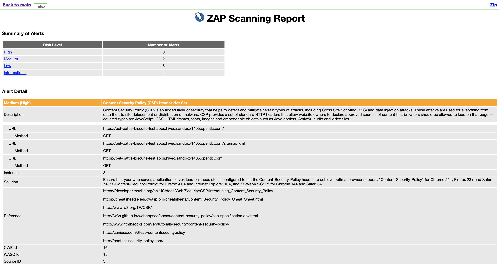

## Extend Jenkins Pipeline with OWASP Zap Security Scanning

1. Add a new Jenkins agent with `zap` command line in it. Open up `ubiquitous-journey/values-tooling.yaml` and under `Jenkins` add `jenkins-agent-zap` to the list.

    ```yaml
            # default names, versions, repo and paths set on the template
            - name: jenkins-agent-npm
            - name: jenkins-agent-mvn
            - name: jenkins-agent-helm
            - name: jenkins-agent-argocd
            - name: jenkins-agent-zap # add this one!!
    ```

    Push the changes to git repository:

    ```bash
    cd /projects/tech-exercise
    git add ubiquitous-journey/values-tooling.yaml
    git commit -m  "🐝 ADD - Zap Jenkins Agent 🐝"
    git push
    ```

    <p class="warn">If you get an error like <b>error: failed to push some refs to..</b>, please run <b><i>git pull</i></b>, then push your changes again by running above commands.</p>

2. Open up `/projects/pet-battle/Jenkinsfile` and add the below stage where `// 🐝 OWASP ZAP STAGE GOES HERE` placeholder is, to trigger ZAP scanning against Pet Battle. This stage will create a report on possible security vulnerabilities.

    ```groovy
            // 🐝 OWASP ZAP STAGE GOES HERE
            stage('🐝 OWASP Scan') {
                agent { label "jenkins-agent-zap" }
                steps {
                sh '''
                    /zap/zap-baseline.py -r index.html -t https://pet-battle-${TEAM_NAME}-test.<CLUSTER_DOMAIN> || return_code=$?
                    echo "exit value was  - " $return_code
                ''' }
                post {
                always {
                    // publish html
                    publishHTML target: [
                        allowMissing: false,
                        alwaysLinkToLastBuild: false,
                        keepAll: true,
                        reportDir: '/zap/wrk',
                        reportFiles: 'index.html',
                        reportName: 'OWASP Zed Attack Proxy'
            ] }
            } }
    ```

3. Push your changes, then observe the pipeline:

    ```bash
    cd /projects/pet-battle
    git add Jenkinsfile
    git commit -m  "🍯 ADD - OWASP ZAP scanning 🍯"
    git push
    ```

4. On Jenkins we should be able to see the test results. On the left hand side, you'll see "OWASP Zed Attack Proxy"
    
    
