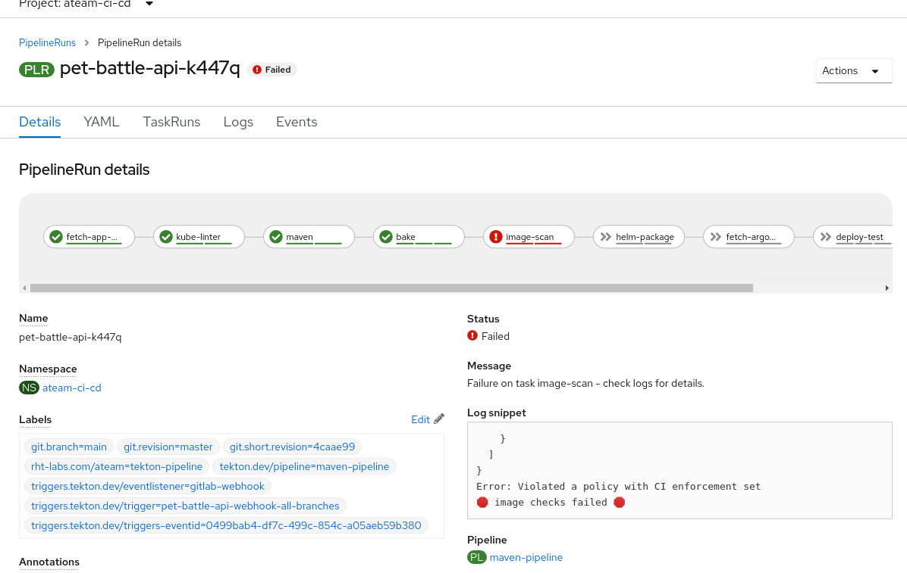

# Extend Tekton Pipeline with Stackrox

## Scan Images

1. Add a task into our codebase to scan our built images.

    ```bash
    cd /projects/tech-exercise
    cat <<'EOF' > tekton/templates/tasks/rox-image-scan.yaml
    apiVersion: tekton.dev/v1beta1
    kind: Task
    metadata:
      name: rox-image-scan
    spec:
      workspaces:
        - name: output
      params:
        - name: ROX_SECRET
          type: string
          description: Secret containing the Stackrox endpoint and token as (username and password)
          default: rox-auth
        - name: IMAGE
          type: string
          description: Full name of image to scan (example -- gcr.io/rox/sample:5.0-rc1)
        - name: OUTPUT_FORMAT
          type: string
          description:  Output format (json | csv | pretty)
          default: json
        - name: WORK_DIRECTORY
          description: Directory to start build in (handle multiple branches)
      steps:
        - name: rox-image-scan
          image: registry.access.redhat.com/ubi8/ubi-minimal:8.4
          workingDir: $(workspaces.output.path)/$(params.WORK_DIRECTORY)
          env:
            - name: ROX_API_TOKEN
              valueFrom:
                secretKeyRef:
                  name: $(params.ROX_SECRET)
                  key: password
            - name: ROX_ENDPOINT
              valueFrom:
                secretKeyRef:
                  name: $(params.ROX_SECRET)
                  key: username
          script: |
            #!/usr/bin/env bash
            set +x
            export NO_COLOR="True"
            curl -k -L -H "Authorization: Bearer $ROX_API_TOKEN" https://$ROX_ENDPOINT/api/cli/download/roxctl-linux --output roxctl  > /dev/null; echo "Getting roxctl"
            chmod +x roxctl > /dev/null
            ./roxctl image scan --insecure-skip-tls-verify -e $ROX_ENDPOINT:443 --image $(params.IMAGE) --format $(params.OUTPUT_FORMAT)
    EOF
    ```

2. Its not real unless its in git

    ```bash
    # git add, commit, push your changes..
    cd /projects/tech-exercise
    git add .
    git commit -m  "🐡 ADD - rox-image-scan-task 🐡"
    git push 
    ```

3. Lets try this in our pipeline. Edit `maven-pipeline.yaml` and add a step definition that runs after the **bake** image task. Be sure to adjust the **helm-package** task to `runAfter` the **image-scan** task:

    ```yaml
        # Image Scan
        - name: image-scan
          runAfter:
          - bake
          taskRef:
            name: rox-image-scan
          workspaces:
            - name: output
              workspace: shared-workspace
          params:
            - name: IMAGE
              value: "$(tasks.bake.results.IMAGE)"
            - name: WORK_DIRECTORY
              value: "$(params.APPLICATION_NAME)/$(params.GIT_BRANCH)"
            - name: OUTPUT_FORMAT
              value: pretty
    ```

    So you'll have a pipeline definition like this:
    <div class="highlight" style="background: #f7f7f7">
    <pre><code class="language-yaml">
      ...
      # Image Scan
        - name: image-scan
          runAfter:
          - bake
          taskRef:
            name: rox-image-scan
      ...
      ...
      - name: helm-package
          taskRef:
            name: helm-package
          runAfter: <- make sure you update this❗❗
            - image-scan <- make sure you update this❗❗
      ...
    </code></pre></div>

4. Check in these changes.

    ```bash
    # git add, commit, push your changes..
    cd /projects/tech-exercise
    git add .
    git commit -m  "🔑 ADD - image-scan step to pipeline 🔑"
    git push 
    ```

5. Trigger a pipeline build.

    ```bash
    cd /projects/pet-battle-api
    git commit --allow-empty -m "🩴 test image-scan step 🩴"
    git push
    ```

    🪄 Observe the **pet-battle-api** pipeline running with the **image-scan** task.

## Check Build/Deploy Time Violations

?> **Tip** We could extend the previous check by changing the output format to **json** and installing and using the **jq** command. For example, to check the image scan output and return a results when the **riskScore** and **topCvss** are below a certain value say. These are better handled as *Build Policy* within ACS which we can check next.

1. Lets add another step to our **rox-image-scan** task to check for any build time violations.

    ```bash
    cd /projects/tech-exercise
    cat <<'EOF' >> tekton/templates/tasks/rox-image-scan.yaml
        - name: rox-image-check
          image: registry.access.redhat.com/ubi8/ubi-minimal:8.4
          workingDir: $(workspaces.output.path)/$(params.WORK_DIRECTORY)
          env:
            - name: ROX_API_TOKEN
              valueFrom:
                secretKeyRef:
                  name: $(params.ROX_SECRET)
                  key: password
            - name: ROX_ENDPOINT
              valueFrom:
                secretKeyRef:
                  name: $(params.ROX_SECRET)
                  key: username
          script: |
            #!/usr/bin/env bash
            set +x
            export NO_COLOR="True"
            curl -k -L -H "Authorization: Bearer $ROX_API_TOKEN" https://$ROX_ENDPOINT/api/cli/download/roxctl-linux --output roxctl  > /dev/null; echo "Getting roxctl"
            chmod +x roxctl > /dev/null
            ./roxctl image check --insecure-skip-tls-verify -e $ROX_ENDPOINT:443 --image $(params.IMAGE) --json --json-fail-on-policy-violations=true
            if [ $? -eq 0 ]; then
              echo "🦕 no issues found 🦕";
              exit 0;
            else
              echo "🛑 image checks failed 🛑";
              exit 1;
            fi
    EOF
    ```

2. Its not real unless its in git

    ```bash
    # git add, commit, push your changes..
    cd /projects/tech-exercise
    git add .
    git commit -m  "🐡 ADD - rox-image-check-task 🐡"
    git push
    ```

3. Trigger a pipeline run

    ```bash
    cd /projects/pet-battle-api
    git commit --allow-empty -m "🩴 test image-check step 🩴"
    git push
    ```

4. Our Pipeline should look like this now with two `image-scan` steps.

    

    🪄 Observe the **pet-battle-api** pipeline running with the **image-scan** task.

## Breaking the Build

Let's run through a scenario where we break/fix the build using a build policy violation.

1. Let's try breaking a *Build Policy* within ACS by triggering the *Build* policy we enabled earlier.

2. Edit the `pet-battle-api/Dockerfile.jvm` and add the following line under `EXPOSE 8080`:

    ```bash
    EXPOSE 22
    ```

3. Check in this change and watch the build that is triggered.

    ```bash
    # git add, commit, push your changes..
    cd /projects/pet-battle-api
    git add .
    git commit -m  "🐉 Expose port 22 🐉"
    git push
    ```

4. This should now fail on the **image-scan/rox-image-check** task.

    

5. Back in ACS we can also see the failure in the *Violations* view.

    

6. Remove the `EXPOSE 22` from the `Dockerfile.jvm` and check it in to make the build pass.

    ```bash
    cd /project/pet-battle-api
    git add .
    git commit -m  "🐧 FIX - Security violation, remove port 22 exposure 🐧"
    git push
    ```

🪄 Observe the **pet-battle-api** pipeline running successfully again.
