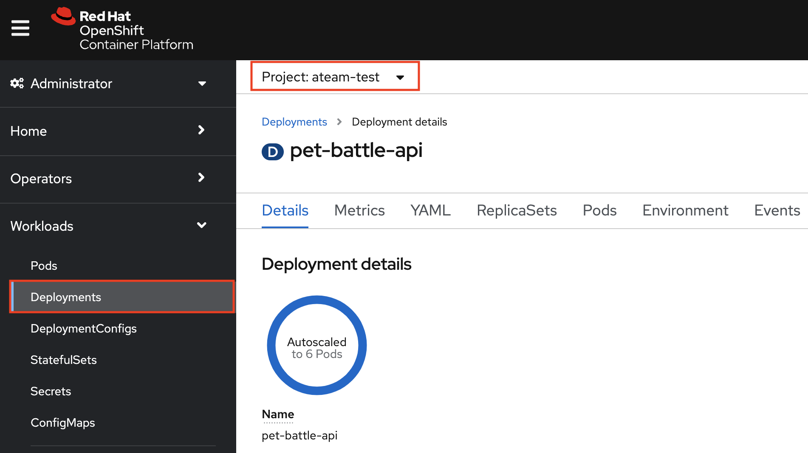
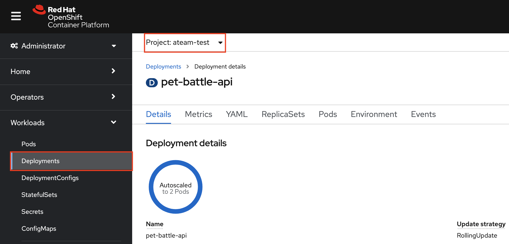

## Autoscaling
Horizontal pod autoscaler (HPA) helps us to specify how OpenShift should automatically increase or decrease the scale of an application, based on metrics collected from the pods. After we define an HPA (based on CPU and/or memory usage metrics), the platform calculates the current usage and compare it with the desired utilization, then scales pods up or down accordingly.

1. The Pet Battle API helm chart contains the Horizontal Pod Autoscaler yaml. By default we've switched it off. This is what it looks like:

  <div class="highlight" style="background: #f7f7f7">
  <pre><code class="language-yaml">
  # Source: pet-battle-api/templates/hpa.yaml
  apiVersion: autoscaling/v2beta2
  kind: HorizontalPodAutoscaler
  metadata:
    name: pet-battle-api
  spec:
    scaleTargetRef:
      apiVersion: apps/v1
      kind: Deployment
      name: pet-battle-api
    minReplicas: 2
    maxReplicas: 6
    metrics:
      - type: Resource
        resource:
          name: cpu
          target:
            type: AverageValue
            averageValue: 200m
      - type: Resource
        resource:
          name: memory
          target:
            type: AverageValue
            averageValue: 300Mi
  </code></pre></div>

2.  Often we only enable the HPA in the staging or prod environments so being able to configure it on / off when testing is useful. To turn it on in a given environment, we can simply supply new values to our application config. Update the `tech-exercise/pet-battle/test/values.yaml` by setting the `hpa` to `enabled:true`
  ```yaml
    # Pet Battle API
    pet-battle-api:
      name: pet-battle-api
      enabled: true
      source: http://nexus:8081/repository/helm-charts
      chart_name: pet-battle-api
      source_ref: 1.1.0
      values:
        image_name: pet-battle-api
        image_version: 1.0.0
        # ✋ ✋ ADD THIS CONFIG BELOW TO YOUR values.yaml FILE 
        hpa:
          enabled: true
          cpuTarget: 200m
          memTarget: 300Mi
  ```

3. Git commit the changes. We probably don't need to tell you the commands to do this by now, but just incase... here they are again 🐎🐎🐎 ! 
  ```bash
  cd /projects/tech-exercise
  git add pet-battle/test/values.yaml
  git commit -m  "🐎ADD - HPA enabled for test env 🐎 "
  git push
  ```

4. With the change synchronized, we should see a new object in ArgoCD and the cluster. Feel free to check those out

5. Let's now test our pod autoscaler, to do this we want to fire lots of load on the API of pet-battle. This should trigger an autoscale due to the increased load on the pods. `hey` is simple load testing tool that can be run from the command line that will fire lots of load at our endpoint:
  ```bash
  hey -t 30 -c 10 -n 10000 -H "Content-Type: application/json" -m GET https://$(oc get route/pet-battle-api -n ${TEAM_NAME}-test --template='{{.spec.host}}')/cats 
  ```
  Where:
  * -c: Number of workers to run concurrently (10)
  * -n: Number of requests to run (10,000)
  * -t: Timeout for each request in seconds (30)

6. While this is running, we should see in OpenShift land the autoscaler is kickin in and spinnin gup additional pods. If you navigate to the pet-battle-api deployment, you should see the replica count has jumped



7. After a few moments you should see the autoscaler settle back down and the replicas are reduced.

