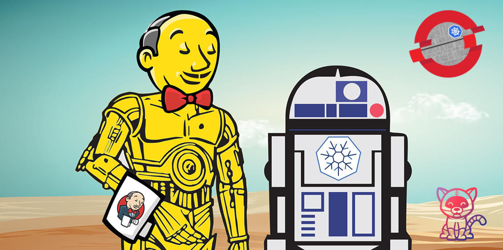

# DevOps Culture & Practice



## 🪄 Customise The Instructions
The box on the top of the page allows you to load the docs with variables used by your team prefilled. All you have to do is fill in the boxes on the top of the page with your teams name in the box and the domain your cluster is using and hit `save`. This will persist the values in your local storage for the site - so hitting `clear` will reset these for you if you made a mistake.
* If my team is called `biscuits` then pop that in the first box. This value will be prefixed to some of the things such as the namespaces we use.
* For the cluster domain, you want to add the `apps.*` the bit from the OpenShift domain. For example if my console address lives at <code class="language-yaml">https://console-openshift-console.apps.hivec.sandbox1243.opentlc.com/</code>
 then just put `apps.hivec.sandbox1243.opentlc.com` in the box to generate the correct address for the exercises.

## 🦆 Conventions
When running through the exercise, we're tried to call out where things need replacing. The key ones are anything inside an `<>` should be replaced. For example, if your team is called `biscuits` then in the instructions if you see `\<TEAM_NAME\>` this should be replaced with `biscuits` like so:
    <div class="highlight" style="background: #f7f7f7">
    <pre><code class="language-bash">
    name: <\TEAM_NAME\>
    # ^ this becomes
    name: biscuits
    </code></pre></div>

There are lots of code blocks for you to copy and paste. They have little ✂️ icon on the right if you move your cursor on the code block. 
```bash
echo "like this one :)"
```
But there are also some blocks that you shouldn't copy and paste which doesn't have the copy✂️ icon. That means you should validate your outputs or yamls against the given block.