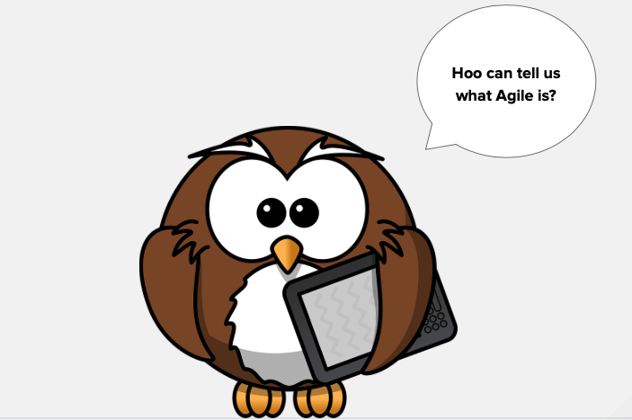
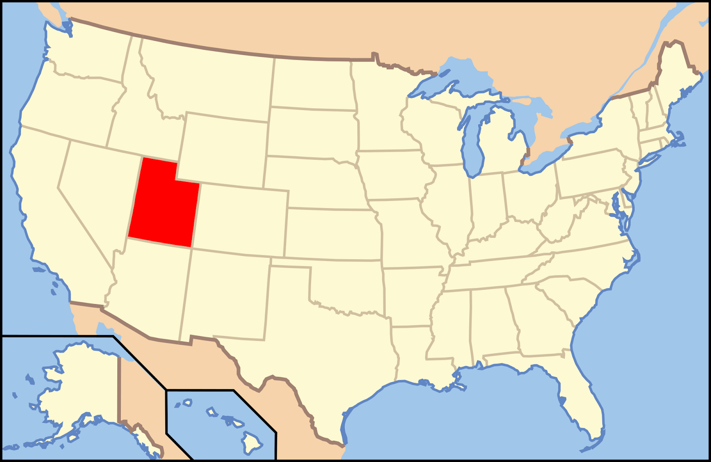
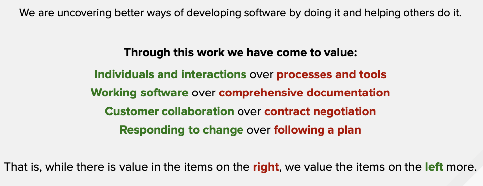
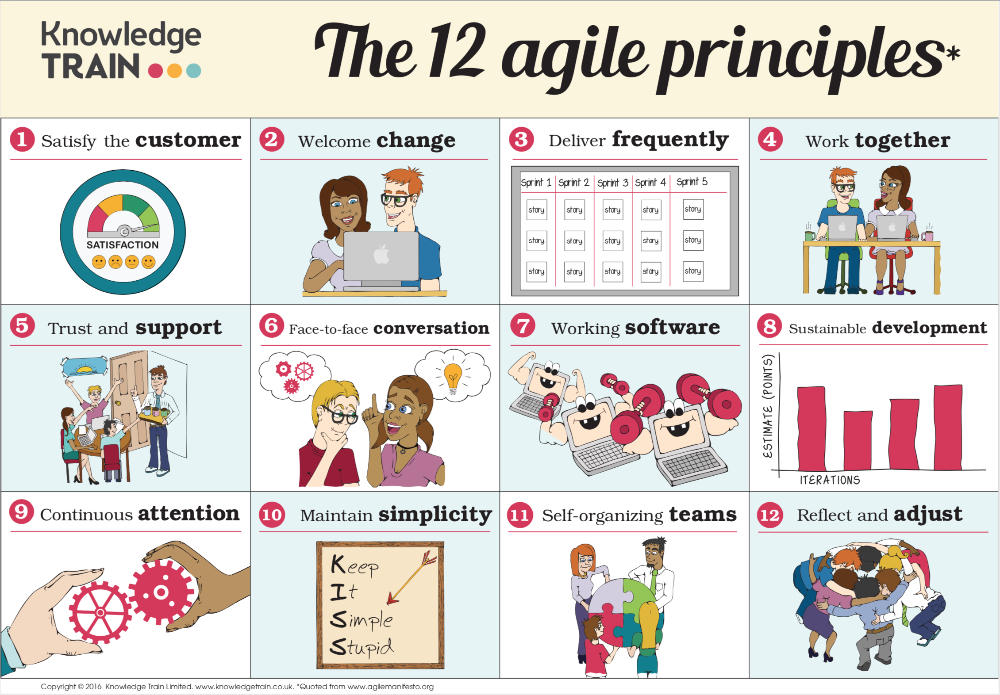

<!-- .slide: data-background-image="images/RH_NewBrand_Background.png" -->
## DevOps Culture and Practice <!-- {.element: class="course-title"} -->
### Agile Overview <!-- {.element: class="title-color"} -->
DO500 <!-- {.element: class="title-color"} -->

## Exercise - What is Agile?...
_Answer the question "What is Agile?"_
1. Everyone grab one sticky note.
2. Answer the question "What is Agile?" with one or two words that first
come to mind.
3. Add your sticky to the wall.

<!-- .slide: id="agile"-->
### Where did agile come from?
February 2001: Snowbird Resort, Utah, United States
 <!-- {.element: class="inline-image"} -->
* 17 software developers
* Identified common things that did and did not work
* Defined values that recommended best practices for software development
* Started a movement instead of defining a process

### Agile Manifesto

### 4 Values
  <!-- {.element: class="" style="height:550px"} -->

### 12 Principles
  <!-- {.element: class="" style="height:550px"} -->

### 12 Principles of the Agile Manifesto
* Our highest priority is to satisfy the customer through early and
continuous delivery of valuable software.
* Welcome changing requirements, even late in development. Agile processes harness change for the customer's competitive advantage.
* Deliver working software frequently, from a couple of weeks to a couple of months, with a preference to the shorter timescale.
* Business people and developers must work together daily throughout the project.

* Build projects around motivated individuals. Give them the environment and support they need, and trust them to get the job done.
* The most efficient and effective method of conveying information to and within a development team is face-to-face conversation.

### 12 Principles of the Agile Manifesto (cont.)
* Working software is the primary measure of progress.
* Agile processes promote sustainable development. The sponsors, developers, and users should be able to maintain a constant pace indefinitely.
* Continuous attention to technical excellence and good design enhances agility.
* Simplicity--the art of maximizing the amount of work not done--is essential.
* The best architectures, requirements, and designs emerge from self-organizing teams.
* At regular intervals, the team reflects on how to become more effective, then tunes and adjusts its behavior accordingly.

### Exercise - Pocket Sized Principles
Working in teams:
1. On a piece of paper make room for 12 boxes.
2. For each box, write 2 to 3 words maximum that effectively capture each of the 12 principles.

http://tastycupcakes.org/2010/01/pocket-sized-principles/ <!-- {.element: class="small"} -->

### Pocket Sized Principles Examples
| | | | |
|---|---|---|---|
| 1. Satisfy the customer | 2. Welcome change | 3. Deliver frequently | 4. Work together |
| 5. Trust and support | 6. Face-to-face conversation | 7. Working software | 8. Sustainable development |
| 9. Continuous attention | 10. Maintain simplicity | 11. Self-organizing teams | 12. Reflect and adjust |
| | | | |

## What are the Benefits of Agile?

### Increased Visibility
The agile approach can lead to increased visibility within projects as deliverables are typically built and tested by real users much sooner than with the traditional approach.

### Increased Adaptability
Because the agile approach heavily relies on iterative processes and review, agile teams are better enabled to adapt to changes from the business.

### Increased Business Value
With the agile approach, business value can increase much sooner than with the traditional approach. And because of continuous improvement and feedback cycles, the value is able to be sustained and maximized for the duration of the project.

### Minimized Risk
The agile approach can minimize risk by getting a working piece of software into the user's hands faster, while allowing for fast updates per user feedback. This ensures that customers are involved early in the process, while continuing to maintain a steady, incremental path toward the desired solution.

#### Agile Product Ownership in a Nutshell
<iframe width="600" height="480" src="https://www.youtube.com/embed/502ILHjX9EE" frameborder="0" allow="accelerometer; autoplay; encrypted-media; gyroscope; picture-in-picture" allowfullscreen></iframe>

<!-- .slide: data-background-image="images/chef-background.png", class="white-style" -->
### DevOps practices used in this section:
- [Agile Manifesto](https://agilemanifesto.org)
