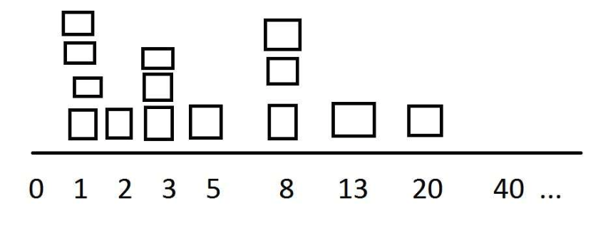

<!-- .slide: data-background-image="images/RH_NewBrand_Background.png" -->
## DevOps Culture and Practice <!-- {.element: class="course-title"} -->
### Estimation <!-- {.element: class="title-color"} -->
TL500 <!-- {.element: class="title-color"} -->

<!-- .slide: data-background-size="stretch" data-background-image="images/opl-logo.png", class="white-style" -->

  <h2>Open Practice Library</h2>
  

  <h2>Estimation</h2>
  

<!--.slide: id="social-contract" -->
##### Example - WHO <!-- .element: class="title-bottom-left" -->
<!-- .slide: data-background-size="contain" data-background-image="images/estimation/example-who.png", class="white-style" -->

#### _What is it?_
* A mechanism for sizing different work items relative to each other
* A tool to facilitate conversations, especially where there are different views on relative sizes
* Common formats to call it: relative estimation, planning poker, count number of work items

#### _Why use it?_
* Facilitates conversation
* Helps align groups of people to reach consensus on their understanding regarding the size of complexity and/or value of an item
* Avoids the emotion, buffering and other negative side effects of absolute estimation

#### _How can it be used?_
_Things to have in consideration before starting:_ <!--{.element: style="font-size: smaller; font-weight: 100;"} -->
* First we need to have done the product backlog refinement and the sprint planning.
* After we picked the user stories for the next sprint and put them into the Relative Estimation board.

#### _How can it be used?_
1. We draw a ladder and agree on the points we are going to use. A common practice is to use the Fibonacci series.

<!-- {.element: class="" style="border:none; box-shadow:none; max-width:40%;" } -->

2. Then we start the sizing for the stories: the first step is to identify the 1-pointer
3. From there we then compare the other user stories to the previous items:
    - Maybe the second user story is a bit harder, so let's call that a 2-pointer
    - Then the next user story we need to ask ourselves how much harder or easier it is compared to the others

#### _How can it be used?_
_An example_ <!--{.element: style="font-size: smaller; font-weight: 100;"} -->
* 'Okay we have story A, is this bigger than the 3 points we have here?'
* Assuming yes - 'Okay is it bigger than the 8 pointer? Or is it roughly the same size'
* Assuming no - 'Okay so we'll say its a 5 pointer then'

### Exercise - Fruit Salad 🥗
#### _Relative Estimation_
* Individually - write as many fruits as you can think of

### Exercise - Fruit Salad 🥗
#### _Relative Estimation_
* As a Team
  * Compare and remove duplicates
  * Create 5-7 rows in a space
  * Relative Estimate your fruit based in how hard is to peel and cut each fruit

#### Example
QQ: Is there a PB example?

#### Key Takeaways
 
As we go through these estimations, conversations will occur within the team and you'll discover more with understandings beginning to align. 

In this exercise this might include things like:
  - Perhaps someone has a tool that makes opening coconuts easier so maybe it doesn't require as much effort as we thought?
  - Maybe the orange has pips in it and also it's more difficult than the banana?
<!-- {.element: class="" style="border:none; box-shadow:none; max-width:100%;" } -->

#### Tips
A helpful tool for big planning:
* The Relative estimation line is one technique that can help with this sort of thing allowing for quick and easy estimation based on past experience. This line should contain reference stories that have already been estimated (or preferably completed) and allows the team to compare previous work.
* It is relevant to avoid stories too big that are brought into the sprint and they are carried over multiple sprint, as in face to face engagements.

<!-- .slide: data-background-image="images/chef-background.png", class="white-style" -->
### Related & Used Practices
- [Relative Estimation](https://openpracticelibrary.com/practice/relative-estimation/)
- [Cost of Delay and WSJF(_Weighted Shortest Job First_)](https://openpracticelibrary.com/practice/weighted-shortest-job-first/)
- [T-shirt Sizing](https://openpracticelibrary.com/practice/)
- [Planning Poker](https://openpracticelibrary.com/practice/)
- [Product Backlog Refinement ](https://openpracticelibrary.com/practice/backlog-refinement/)
- [Acceptance Criteria ](https://openpracticelibrary.com/practice/)