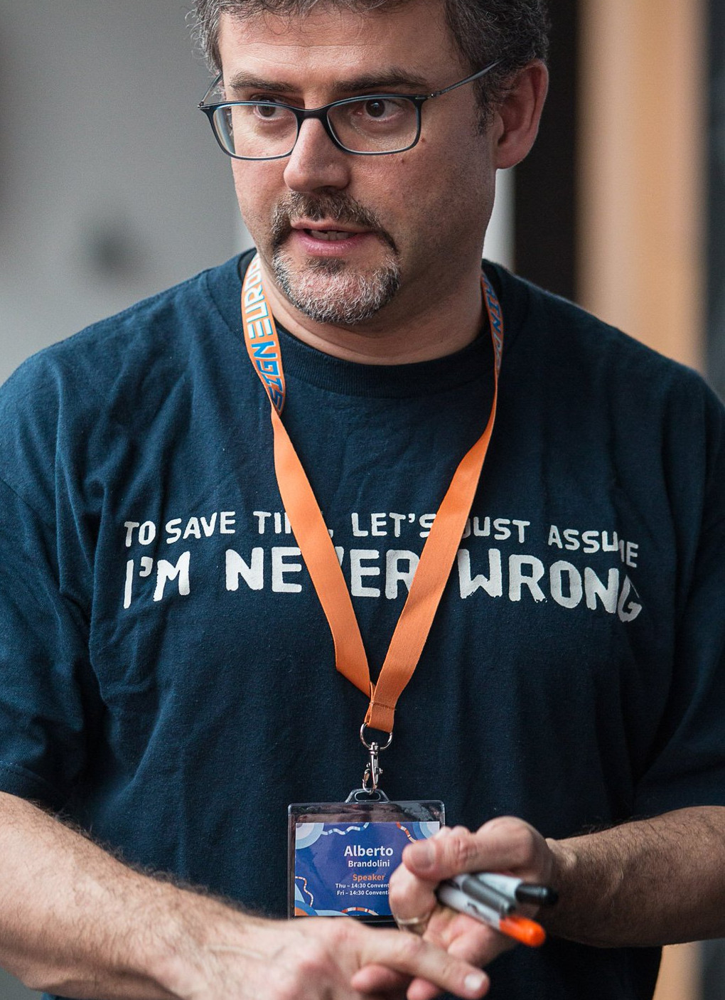
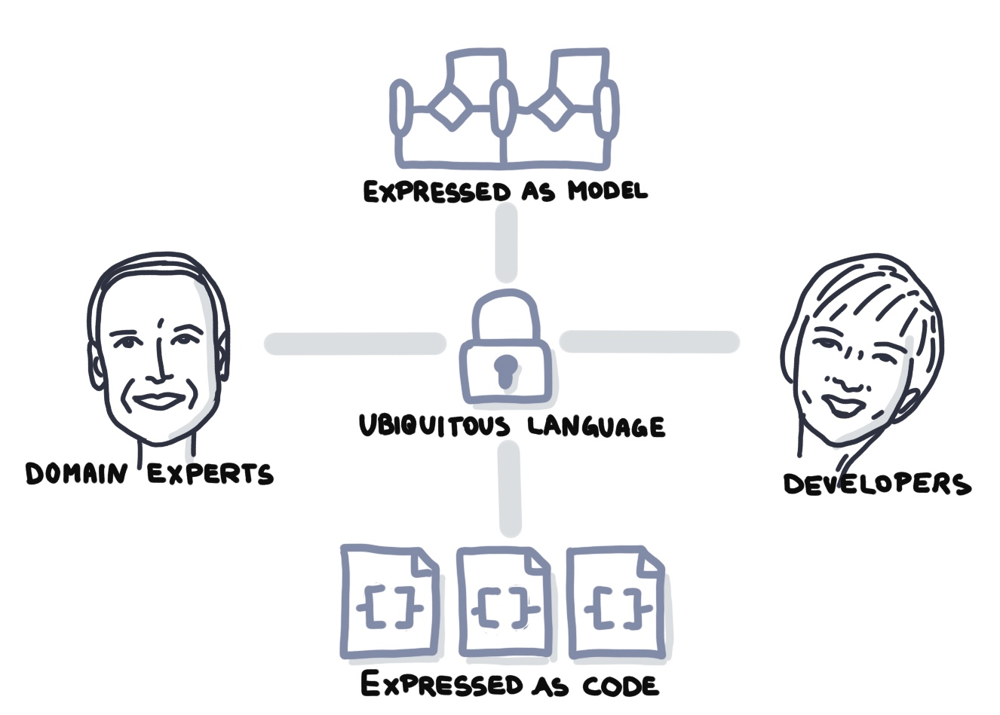
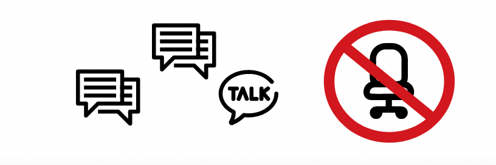
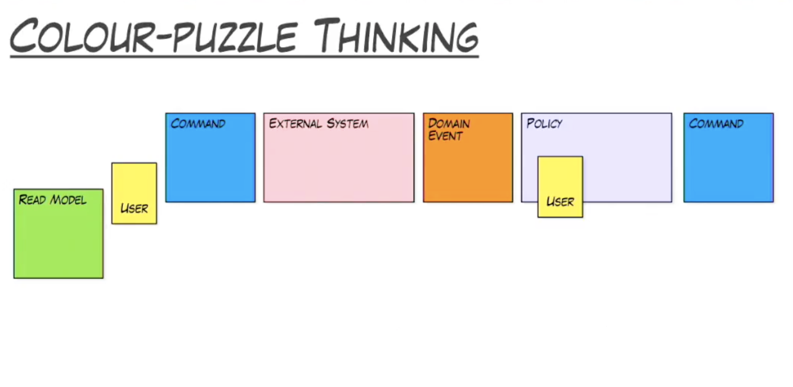

<!-- .slide: data-background-image="images/RH_NewBrand_Background.png" -->
## DevOps Culture and Practice <!-- {.element: class="course-title"} -->
### Event Storming <!-- {.element: class="title-color"} -->
TL500 <!-- {.element: class="title-color"} -->

  <h2>Open Practice Library</h2>
  

  <h2>Event Storming</h2>
  

##### <!-- .element: class="title-bottom-left" -->
<!-- .slide: data-background-size="contain" data-background-image="images/event-storming/example-who.png", class="white-style" -->

### Event Storming
#### _What is it?_
_Event Storming is a rapid, interactive approach to business process discovery and design that yields high quality models_

It provides a repeatable, teachable technique for modeling:
  * Event-driven systems
  * Large microservice-based systems

#### _What is it?_
At the end of the event storm, you should have:
* A shared understanding of the business process you are building as part of the project, including:
<!-- .element: class="image-no-shadow " -->
* A physical diagram with the above information, which can be transferred to a digital format
<!-- ### Event Storming
#### _What is it?_
* Who: key business stakeholders and techies
* There will be lots of talking, a fair bit of squabbling, and periodically
some **very** heated debate
* No chairs!
* Expect a tiring but fun day that achieves a great deal from the most basic of tools -->

#### _Where did it come from?_
 <!-- {.element: class="inline-image" style="max-width:300px;"} -->
It was introduced in a blog by Alberto Brandolini in 2013.
 <!-- {.element: class="" style="max-width:450px;"} -->

It's a sort of Domain Driven Design (DDD) Lite – but with more business focus and less of the jargon and complexity.

#### _Why do we use it?_
* Very simple modelling practice that is accessible to all business people
* Engages all stakeholders and removes technical barriers:
  * Non-technical people can actively contribute
  * Builds a shared understanding
  * Fail fast to solve difficult problems
  * Deliver really useful design artifacts

### Event Storming
#### _Artifacts_
* **Big Picture**: quickly build a shared understanding of a problem space
* **Process Diagram**: model business processes
* **Aggregate Modeling**: find the key microservices, operations, and a retrospective
event model
* **UI Modeling**: model the flow of pages in an application

### 
<!-- .slide: data-background-size="contain" data-background-image="images/event-storming/vision-to-detail.png", class="black-style" -->

### Event Storming - How
#### _Tips for Success_
* Hold a Big Picture Workshop
* Invite the right people: business stakeholders, IT, and User Experience (UX)
* Provide unlimited modeling space with a surface, markers, and stickies
* Model **a whole business line** with domain events
* Frame the discussion to limit the off topic converstation
 <!-- {.element: class="image-no-shadow"} -->

## Event Storming Key

<!-- .slide: data-background-size="contain" data-background-image="images/event-storming/es-flow.png", class="black-style" -->

<!-- .slide: data-background-size="contain" data-background-image="images/event-storming/es-events.png", class="black-style" -->

<!-- .slide: data-background-size="contain" data-background-image="images/event-storming/es-commands-actors.png", class="black-style" -->

<!-- .slide: data-background-size="contain" data-background-image="images/event-storming/es-readmodel.png", class="black-style" -->

<!-- .slide: data-background-size="contain" data-background-image="images/event-storming/es-systems-quests.png", class="black-style" -->

<!-- .slide: data-background-size="contain" data-background-image="images/event-storming/es-policies.png", class="black-style" -->

<!-- .slide: data-background-size="contain" data-background-image="images/event-storming/es-aggregates.png", class="black-style" -->

<!-- .slide: data-background-size="contain" data-background-image="images/event-storming/es-extras.png", class="black-style" -->

<!-- .slide: data-background-size="contain" data-background-image="images/event-storming/es-flow.png", class="black-style" -->

<!-- # complete -->
<!-- .slide: data-background-size="contain" data-background-image="images/event-storming/es-complete.png", class="black-style" -->

### Event Storming: Key Takeaways
* Builds a shared understanding of a problem space
* Models business processes
* Aggregate modeling to find key microservices and event model
* Models the flow of pages in an application
* Aligns stakeholders and IT groups

### Exercise
### Event Storm for To Do List Management
 <!-- {.element: class="inline-image"} -->
* In your teams, create example event storm for the Current state of the To Do List
Management application. Cover the following things:
  1. Add the new Events
  * Add the new Commands, Users and Read Models
  * Are there new Systems or Aggregates?
* Reflect on your Impact Map deliverables and enhance it with some new functionality e.g
  1. Sharing lists between users
  2. Integration with other vendors or providers

<!-- .slide: data-background-image="images/chef-background.png", class="white-style" -->
### DevOps practices used in this section:
- [Event Storming](https://openpracticelibrary.com/practice/event-storming/)
