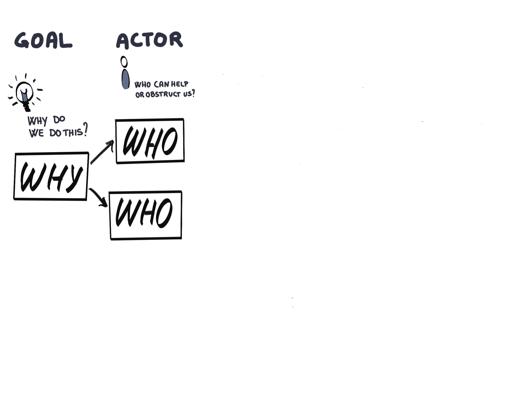
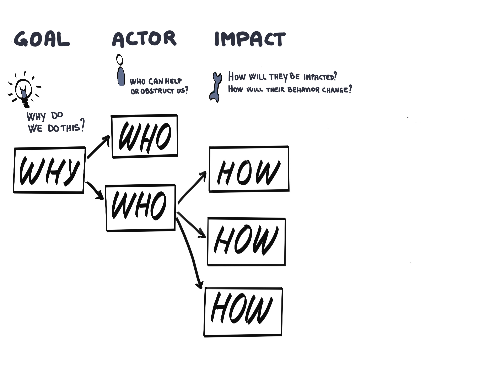
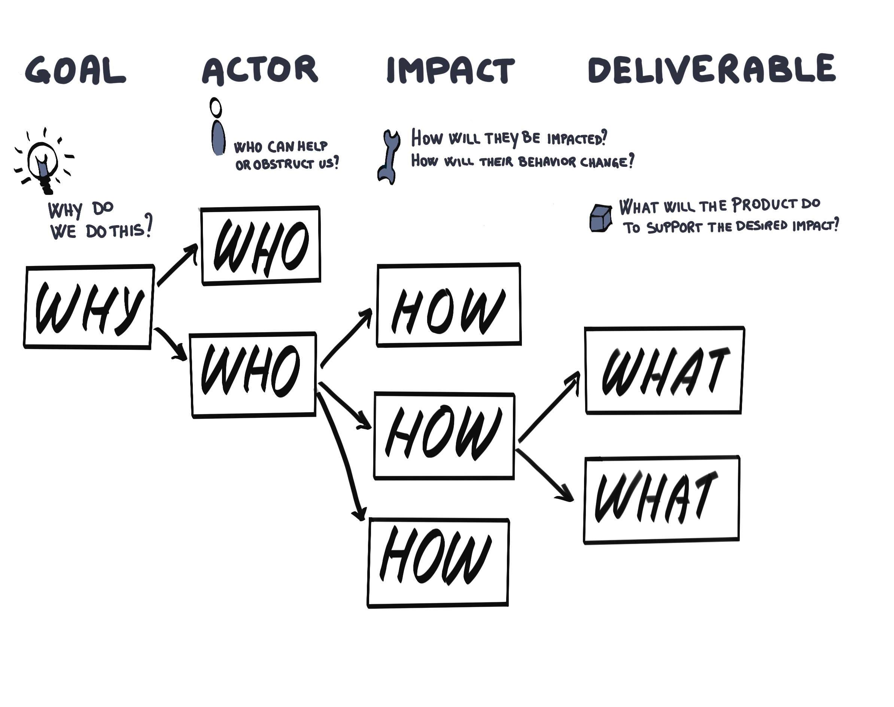

<!-- .slide: data-background-image="images/RH_NewBrand_Background.png" -->
## DevOps Culture and Practice <!-- {_class="course-title"} -->
### Impact Mapping <!-- {_class="title-color"} -->
DO500 <!-- {_class="title-color"} -->

<!-- .slide: id="impact-mapping" -->
## Impact Mapping

### Impact Mapping
#### _What is It?_
Impact Mapping is an engaging, graphical, and strategic planning technique.

At the end of the impact map, you should have:
* A shared understanding of your project's goal or problem statement
* An inventory of human behavioral changes (impacts) that must occur (or not occur)
for your project to be successful
* Optionally, an inventory of project scope that could be delivered to achieve
the aforementioned impacts
* Some sort of prioritization of scope and/or impacts

### Impact Mapping
It was brought to the IT world by Gojko Adzic in 2012. 

  <!-- {_class="" style="height:550px"} -->

  <!-- {_class="" style="height:550px"} -->

  <!-- {_class="" style="height:550px"} -->

  <!-- {_class="" style="height:550px"} -->

### Impact Mapping
#### _Why Use It?_
* Focuses on business objectives
* Re-orients us towards delivering value, not delivering features
* Introduces a very simple human centered design process
* It is a graphical mind map
  * Reduces the barrier to entry for participants and facilitators
* The technique is highly adaptable for time and audience
* Helps identify which hypotheses are the most valuable to test

#### Example Impact Map
<!-- .slide: data-background-size="contain" data-background-image="images/ImpactMapping/ImpactMap.png", class="white-style" -->

### 
<!-- .slide: data-background-size="contain" data-background-image="images/ImpactMapping/ImpactDeliverables.png", class="white-style" -->

### Exercise - Setting the Scene
#### Pet Battle Industries
A silly app that allows users to upload pictures of their 🐈 or 🐕 and enter them into a competition.
* Started as a hobbyist application built by a few friends over a weekend
* Deployed as a single VM running on a free host. Over the weekend a famous person tweeted about the app and it exploded in usage however the application started to fail and crash loads under the load
* The team behind the hobbyist app have decided to quit their jobs and go all in on PBI&trade;

### Exercise - Impact Mapping 1/3
#### *As a class:*

1. Start at the end:
   * Generate 100K in revenue with our new & existing customer base by the end of the year
2. Discuss:
   * Is this a good goal?
3. Diverge <> Converge:
   * Who are the **all** the actors that can get us to our goal?
   * Who are the focus ones? Pick one to two actors per table

### Exercise - Impact Mapping 2/3
#### *As a class:*
1. Walk through creating the Impacts and Deliverables for one Actor 

### Exercise - Impact Mapping 3/3
#### *In your team:*

1. Determine impacts and deliverables for your actors
2. Issue your Donal Dollars&trade; to identify where you should place your bets

# Exercise Wrap Up

[PetBattle Miro Board](https://app.mural.co/t/warhw2023/m/warhw2023/1580744046908/05e98ef35312102d27aa494ff5e92b4ecb1ecc17?sender=dspring0331)

<!-- .slide: data-background-image="images/chef-background.png", class="white-style" -->
### DevOps practices used in this section:
- [Impact Mapping](https://openpracticelibrary.com/practice/impact-mapping/)
