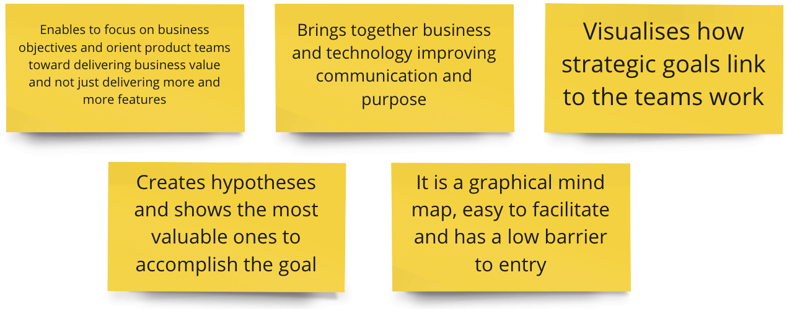
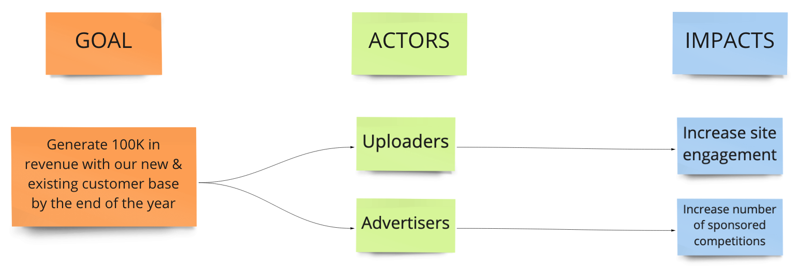

<!-- .slide: data-background-image="images/RH_NewBrand_Background.png" -->
### DevOps Culture and Practice <!-- {.element: class="course-title"} -->
## Impact Mapping <!-- {.element: class="title-color"} -->
TL500 <!-- {.element: class="title-color"} -->

<!-- .slide: data-background-size="stretch" data-background-image="images/opl-logo.png", class="white-style" -->

  <h2>Open Practice Library</h2>
  

  <h2>Impact Mapping</h2>
  

#### Impact Map - World Health Organisation <!-- .element: class="title-bottom-left" -->
<!-- .slide: data-background-size="contain" data-background-image="images/impact-mapping/example-who.png", class="white-style" -->

#### _What is it?_
Impact mapping is a technique that helps build shared understanding and alignment between leaders of organization strategy and product delivery teams.

 

#### At the end of the Impact Mapping exercise, you should have:
<!-- .element: class="image-no-shadow image-full-width" -->
<!--  
#### _What is it?_
At the end of the Impact Mapping exercise, you should have:

* A shared understanding of the goal or problem statement
* An inventory of human behavior changes in users and stakeholders that must occur (or not occur) in order for your project to be successful. These are the impacts from which the technique gets its name
* Optionally, an inventory of project deliverables that could be delivered to achieve the aforementioned impacts
* Some sort of prioritization of scope – one or more deliverables – and/or impacts
-->

####

   

_It's as a lightweight, collaborative planning technique for teams that want to make a big impact with software products_

_It help delivery teams and stakeholders visualize roadmaps, explain how deliverables connect to user needs, and communicate how user outcomes relate to higher level organizational goals_

~ Gojko Adzic

#### Why do we use it?
<!-- .element: class="image-no-shadow " -->
<!--
#### Why do we use it?
* Impact mapping enables to focus on business objectives and orient product teams toward delivering business value and not just delivering more and more features
* Brings together business and technology improving communication and purpose
* Visualises how strategic goals link to the teams work
* Impact Mapping creates hypotheses and shows the most valuable ones to accomplish the goal
* It is a graphical mind map, easy to facilitate and has a low barrier to entry
--->

  
  
  
  
  
  

#### Impact Map - World Health Organisation <!-- .element: class="title-bottom-left" -->
<!-- .slide: data-background-size="contain" data-background-image="images/impact-mapping/example-who.png", class="white-style" -->

### Class Exercise - Setting the Scene

#### Setting the Scene: Pet Battle Industries
A silly app that allows users to upload pictures of their 🐈 or 🐕 and enter them into a competition.
<!-- .element: class="image-no-shadow" -->
<!-- 
* Started as a hobbyist application built by a few friends over a weekend
* Deployed as a single VM running on a free host. Over the weekend a famous person tweeted about the app and it exploded in usage however the application started to fail and crash loads under the load
* The team behind the hobbyist app have decided to quit their jobs and go all in on PBI&trade;
* PBI&trade; are looking to monetize their application
-->

### The Goal & Actors
#### *As a class:*

1. The _`Goal`_ - Is this a good goal?
   * _Generate 100K in revenue with our new & existing customer base by the end of the year_
  
2. The _`Actors`_ - Diverge <> Converge:
   * Who are the **all** the actors that can get us to our goal?
   * Who are the focus ones? Pick one to two actors per table

### The Impacts
#### *As a class:*
1. Walk through creating the _`Impacts`_ for one _`Actor`_

#### *In your team:*
1. Determine _`Impacts`_ for your _`Actors`_

### The Deliverables & Voting
#### *In your team:*
1. Determine some _`Deliverables`_ for the _`Impacts`_ on your _`Actors`_
2. Issue your Donal Dollars&trade; and place your bets on the _`Impacts`_

# Exercise Wrap Up

[PetBattle Miro Board](https://app.mural.co/t/warhw2023/m/warhw2023/1580744046908/05e98ef35312102d27aa494ff5e92b4ecb1ecc17?sender=dspring0331)

#### Impact Map - Pet Battle <!-- .element: class="title-bottom-left" -->
<!-- .slide: data-background-size="contain" data-background-image="images/impact-mapping/pb-full-example.png", class="white-style" -->

#### Facilitation Tips

* Don't spend too long on the goal - get it good enough and move on
* Have a goal preprepared in advance to really speed up the workshop
* If time is a constraint, forget about deliverables and focus just on the impacts
 

#### Tips For Remote

* Break the practice into many sessions
* Use breakout rooms to ideate in smaller size
* Don't rely on the facilitator alone to update the board

<!-- .slide: data-background-image="images/chef-background.png", class="white-style" -->
### Related & Used Practices
- [Start at the End](https://openpracticelibrary.com/practice/start-at-the-end/) - a simple exercise to identify a set of assumptions which must be tested in order achieve a long term goal
