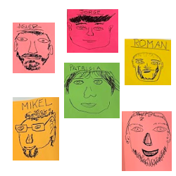

<!-- .slide: data-background-image="images/RH_NewBrand_Background.png"  -->
## DevOps Culture and Practice <!-- {.element: class="course-title"} -->
### Kick Off <!-- {.element: class="title-color"} -->
TL500 <!-- {.element: class="title-color"} -->

<!-- .slide: data-background-size="contain" data-background-image="images/kick-off/campfire-with-burning-wood-logs-and-flame-cartoon-vector-26874382.jpg" -->
## Welcome

#### Agile Faces

Meet your classmates by collaboratively drawing each others faces.

## Exercise
#### Gather your apparatus 🔬🧑‍🔬
1. Take a big Post-It and Sharpie
2. Holding it in portrait, write your name on the top or bottom 

## Exercise
#### Find someone you've never met before
- Pass the Post-It to them <!-- {.element: class="fragment"  data-fragment-index="1"} -->
- Set 30 seconds timer<!-- {.element: class="fragment"  data-fragment-index="2"} -->
- Draw a part of owner's face on the Posts-It:<!-- {.element: class="fragment"  data-fragment-index="3"} -->
  * Eyes <!-- {.element: class="fragment"  data-fragment-index="3"} -->
- Swap back admire the work ... then find a new partner. <!-- {.element: class="fragment"  data-fragment-index="4"} -->
- Repeat the process for more facial features <!-- {.element: class="fragment"  data-fragment-index="5"} -->
  * Nose <!-- {.element: class="fragment"  data-fragment-index="5"} -->
  * Mouth <!-- {.element: class="fragment"  data-fragment-index="6"} -->
  * Hair <!-- {.element: class="fragment"  data-fragment-index="7"} -->
  * Ears <!-- {.element: class="fragment"  data-fragment-index="8"} -->
  * Chin / Facial hair <!-- {.element: class="fragment"  data-fragment-index="9"} -->

#### Why Ice Breakers?
- An effective way of starting a team-building event
- Help people get to know each other

#### When Ice Breakers?  
- Participants come from different backgrounds
- People need to bond quickly so as to work towards a common goal
- A team is newly formed

#### While you're all standing
### The Next Five Days...

### Introducing
#### The room and the walls
- [Backlog](https://openpracticelibrary.com/practice/backlog-refinement/)
- [Work Visualization](https://openpracticelibrary.com/practice/visualisation-of-work/)
- [Burndown](https://openpracticelibrary.com/practice/burndown/)
 <!-- {.element: class="inline-image"} -->
- [Definition of Done](https://openpracticelibrary.com/practice/definition-of-done/)
- [Team Sentiment](https://openpracticelibrary.com/practice/team-sentiment/)
- [Real Time Retro](https://openpracticelibrary.com/practice/realtime-retrospective/)
- [Big Picture](https://openpracticelibrary.com/practice/the-big-picture/)
- [Practice Corner]()
- [Parking Lot (Car Park)](https://openpracticelibrary.com/practice/parking-lot-car-park/)
- [Quote Wall](https://openpracticelibrary.com/practice/quote-wall/)
- [Stop the World](https://openpracticelibrary.com/practice/stop-the-world-event/)

All of these things are Information Radiators - they display information realtime and publicly. 

🥶 Don't be an Information Refrigerator 🧊

<!-- .slide: id="information-radiators"-->
### Information Radiators
#### _An Information Radiator..._
- Involves radiating and visually representing all aspects of work
- Typically means information that is useful to team members, stakeholders and users is physically presented on walls, windows, doors and other flat surfaces and positioned in the line of sight of those people who will get value from consuming the information
- Enables the ability to "Walk the Walls", where someone interested in the work can walk around the physical space the associated team(s) are working from and get all the information they need from inspecting artefacts on the wall and from the resulting conversations

### Information Radiators
#### _Why visualize work?_
- Facilitates a transparent and open way of working
- Avoids hiding information about status, progress, direction, challenges and opportunities related to a project
- Where important information is constantly accessible and visible to people, both speed and accuracy of their work can improve with reduced wastage from having to search for information
- It is more likely that the information is accurate because people are continuously being reminded of it

## Exercise - Animals
<!-- {.element: class="inline-image"} -->
  
Draw a simple representation of an animal that you feel represents your current mood

## Back to the Animals!
Introduce yourself to the group and share your animal   
- What is your name?
- Where are you from?
- What is your current role within your organization?
- Show and Tell: your animal drawing

<!-- .slide: id="target-outcomes"-->
### Target Outcomes

#### What are your expectations for the week?

* Everyone grab a pen and a few sticky notes
* Individually write your expectations (one per sticky note)
* Add them to a class board named expectations
* Group them by affinity
* Discuss comparing the course Target Outcomes

#### _What are Target Outcomes?_
- Are a tool to capture and articulate the goals and outcomes a team are striving to deliver
- Can include customer (end user) based outcomes as well as business and capability based outcomes
- Often harnesses and summarizes the findings and learnings from other Discovery practices into a finite set of statements that can be publicly displayed for team and stakeholders to regularly reference

<!-- .slide: data-background-size="contain" data-background-image="images/kick-off/Output-vs-Outcome-vs-Impact.png" -->

### Learning Target Outcomes
#### _What are **our** Target Outcomes?_
- Generate enthusiasm for DevOps culture and practices
- Explore all principle practices used in everyday discovery and delivery
- Have fun!

#### Target Outcomes - World Health Organisation <!-- .element: class="title-bottom-left" --> 
<!-- .slide: data-background-size="contain" data-background-image="images/kick-off/example-to-who.png" -->

### Exercise - Team Formation
* Form a straight line across the room in order of relative technical experience in development engineering practices
* Assign each person a number 1,2,3,4,1,2,3,4,1,2... to divide the group into balanced teams
* Each member with the same number is on the same team  

<!-- .slide: data-background-image="images/chef-background.png" class="white-style" -->
### Related & Used Practices

- Practice Corner
- [Parking Lot (Car Park)](https://openpracticelibrary.com/practice/parking-lot-car-park/)
- [Quote Wall](https://openpracticelibrary.com/practice/quote-wall/)
- [Stop the world](https://openpracticelibrary.com/practice/stop-the-world-event/)
- Ice Breakers
- Team Forming
- Information Radiators
   

- [Backlog](https://openpracticelibrary.com/practice/backlog-refinement/)
- [Work Visualization](https://openpracticelibrary.com/practice/visualisation-of-work/)
- [Burndown](https://openpracticelibrary.com/practice/burndown/)
- [Definition of Done](https://openpracticelibrary.com/practice/definition-of-done/)
- [Team Sentiment](https://openpracticelibrary.com/practice/team-sentiment/)
- [Real Time Retro](https://openpracticelibrary.com/practice/realtime-retrospective/)
- [Big Picture](https://openpracticelibrary.com/practice/the-big-picture/)

