<!-- .slide: data-background-image="images/RH_NewBrand_Background.png" -->
## DevOps Culture and Practice <!-- {.element: class="course-title"} -->
### Metric-Based Process Mapping <!-- {.element: class="title-color"} -->
TL500 <!-- {.element: class="title-color"} -->

### Batch Processing
#### _What is it?_
* Concurrent work being done
* Typically performed on a schedule or specific timeframe

#### _How can it be used?_
* Help identify Work In Progress limits
* Show flow of work through the team/system

#### [The Penny Game](https://www.leanagiletraining.com/better-agile/agile-penny-game-rules/)
1. Break out into teams and experiment with batch processing using poker chips.
2. Follow the facilitator's instructions.

  <h2>Open Practice Library</h2>
  

  <h2>Metric-Based Process Mapping</h2>
  

### Value Streams 
Each table picks a sector and a business use case (some examples below):
* **Telco** - Ordering a new Broadband package
* **Finance** - Creating new Current Account
* **Government** - Paying for Council Tax
* **Energy** - Switching energy provider
#### Some questions to lead the discussions ...
What is the trigger for the stream?
What is end business value?
What are all the steps in between?
What's the Technology or system that helps with that step?

_DevOps is focused on speeding up that value chain. Metric-Based Process Mapping (MBPM) is a practice that will help visualize all these steps and capture some metrics about how long they take._

### Metric-Based Process Mapping

#### MBPM - Pet Battle <!-- .element: class="title-bottom-left" -->
<!-- .slide: data-background-size="contain" data-background-image="images/mbpm/example-pb.png", class="white-style" -->

#### _What is it?_
* A detailed process mapping practice that captures process steps, responsible actors, and key time and quality metrics.
* Heavily influenced by Karen Martin's work in this area.
* Designed to view the detailed, micro picture and make tactical improvements with front line workers.

<!-- .element: class="image-no-shadow " -->
<!--
It is a third generation lean process improvement techniques, optimizable for an extended organizational transformation effort.
The first generation comes from Toyota's "information and material flow" as documented in Lean Thinking.
The second generation from Learning to See.
-->

#### _Why use it?_
* Holistically analyze and optimize "brownfield" delivery processes, including everything from requirements definition, infrastructure provisioning and application development.
* Visually represent the way work flows through an organization
* Building a shared understanding throughout the various levels of an organization
how the work is actually done.
* Formulating specific, data driven improvement plans.

### Metrics of Velocity
<!-- {.element: class="" style="border:none; box-shadow:none; height:200px; float:left;"} -->

* Frequency of deployments (more frequent is better)
* Lead time for new features: from ideation through delivery (shorter is better)
* Frequency of change failures (fewer changes are better)
* Mean-time-to-repair, MTTR (shorter recovery times are better)

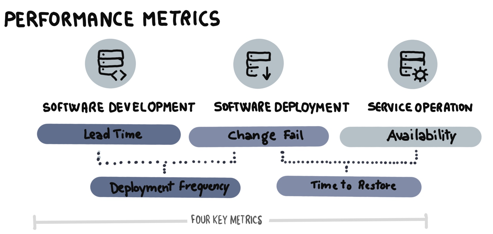<!-- .element: class="image-no-shadow image-full-width " -->

#### Flow Metrics
* **Throughput** — the number of work items finished per unit of time
* **Work in progress (WIP)** — the number of work items started but not finished. The team can use the WIP metric to provide transparency about their progress towards reducing their WIP and improving their flow
* **Cycle Time** — the amount of elapsed time between when a work item starts and when a work item finishes.
* **Work Item Age** — the amount of time between when a work item started and the current time. This applies only to items that are still in progress.

### Metric-Based Process Mapping
How To ...

  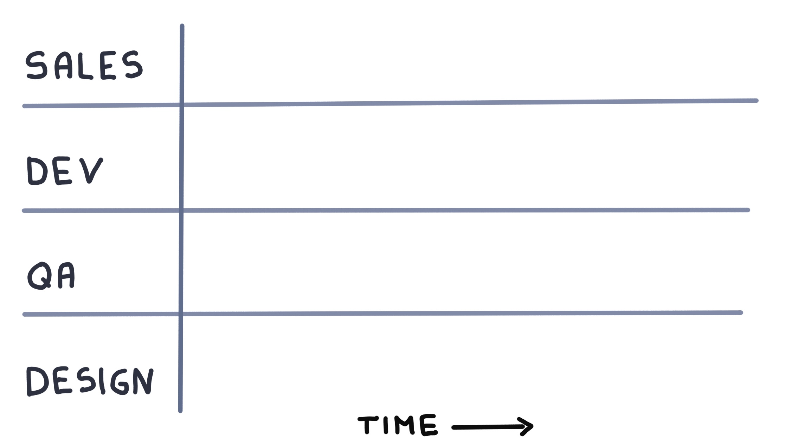
  
  

#### Label the map and create Swim Lanes

#### Add time and the activities (the steps) to the map
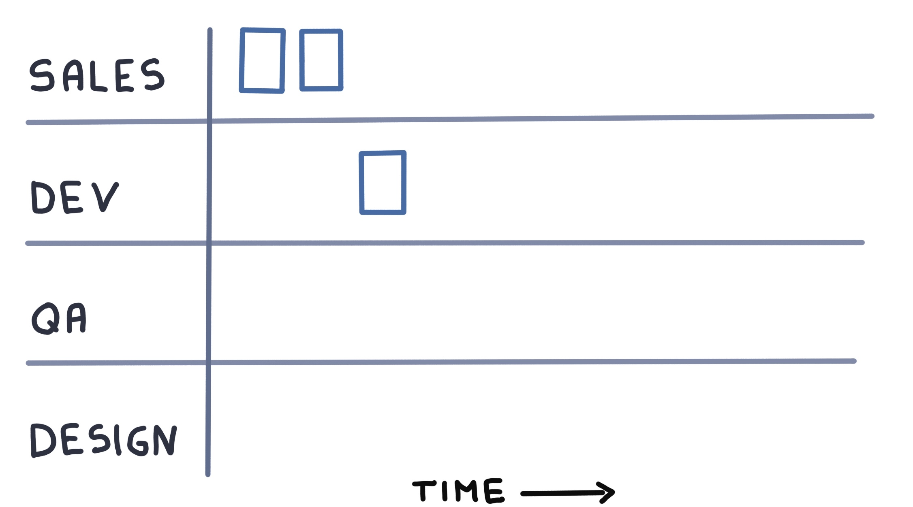

#### Some could be in parallel
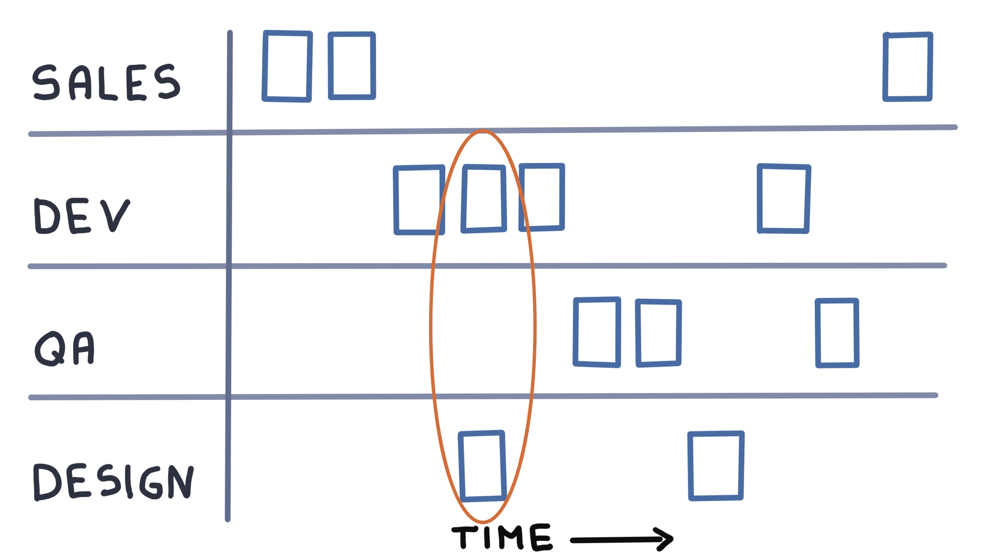

### Metric-Based Process Mapping
Document all activities (the steps)

#### The Activity

#### Name the activity and who's involved
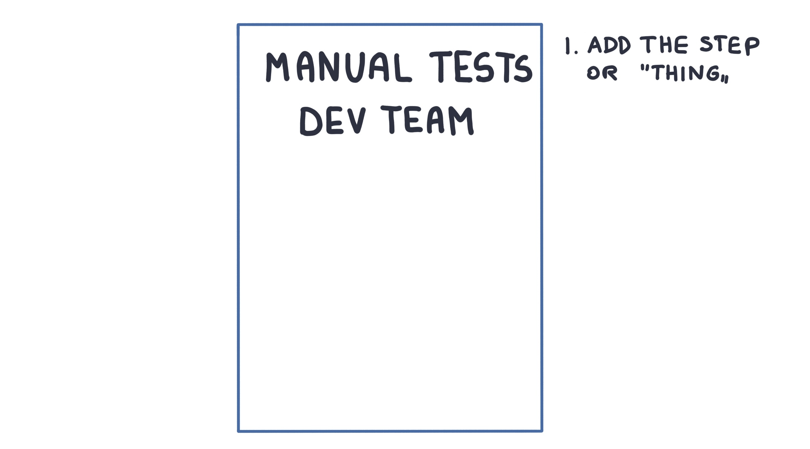

#### Add the number of people 
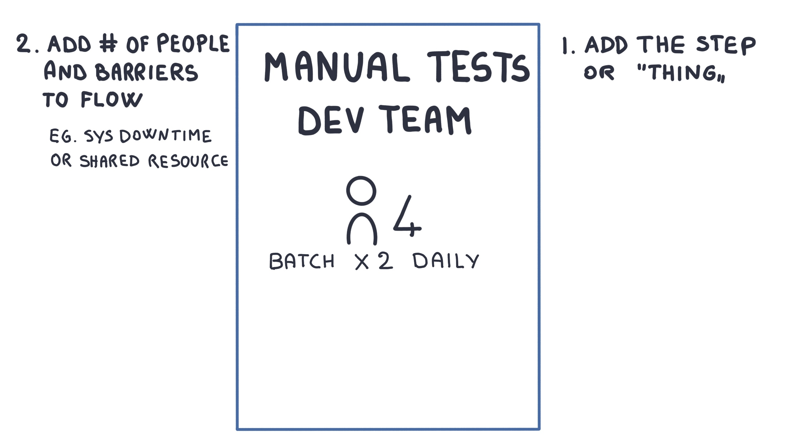

#### Add the accuracy
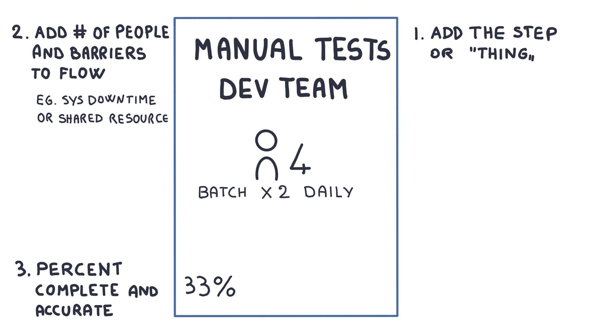

#### Process Time / Lead Time
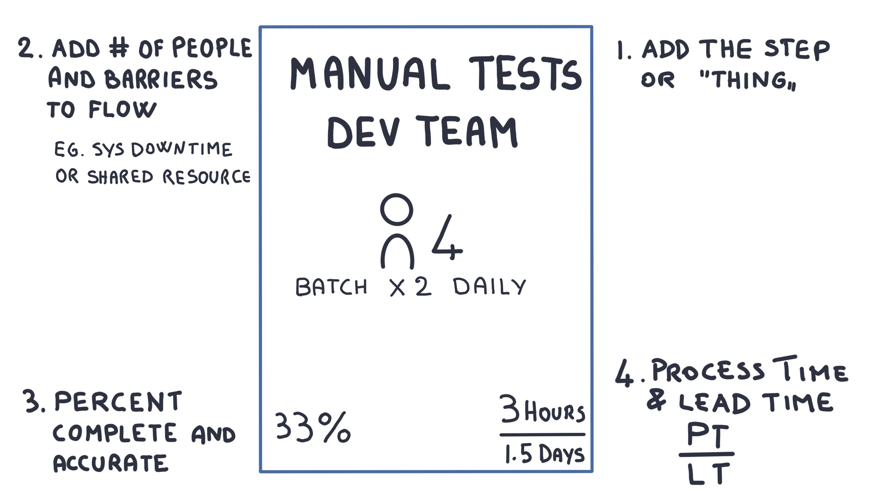

### Metric-Based Process Mapping
Lead Time vs. Process Time

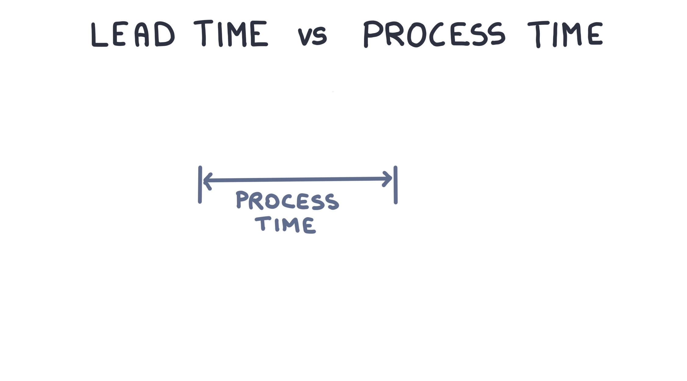

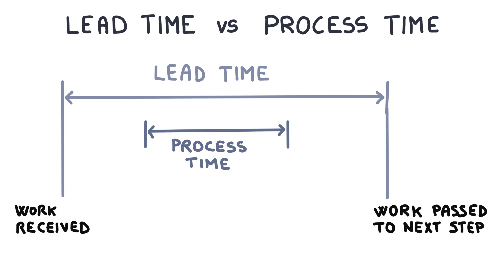

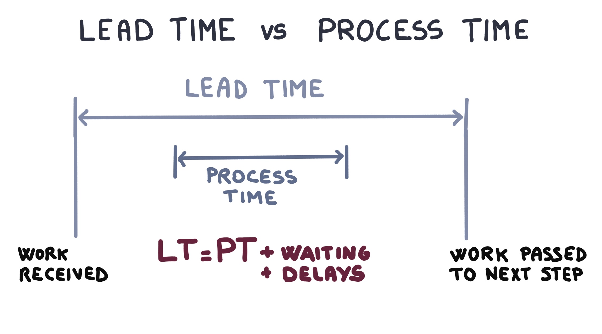

### Metric-Based Process Mapping
#### Metrics: Time
* Process Time (PT)
  * The time to actually do the work, if one is able to do it uninterrupted
  * Includes when specific to the task at hand:

    Touch, talk, read, and think time
* Lead Time (LT)
  * Elapsed time from the time work is made available until it is completed
  and passed on to the next person or department in the chain
  * Includes process

### Metric-Based Process Mapping
#### Metrics: Quality
* Percent complete and accurate
* Percent of time downstream customer can perform task without having to:
  * **Correct** information or material supplied
  * **Add** information that should have been supplied
  * **Clarify** information that should or could have been clearer

### Metric-Based Process Mapping: How To
#### Define the _Timeline Critical Path_

### Metric-Based Process Mapping: What Else To Do?
* Create the timeline
* Create summary metrics
* Identify improvement areas

### Exercise - TODO List MBPM (Assumptions)

* Guardrails are:
  * Start - Feature Complete and ready to commit
  * End - Feature deployed to Test env
* Manual handoff and jobs

### Exercise - TODO List MBPM (Setup)

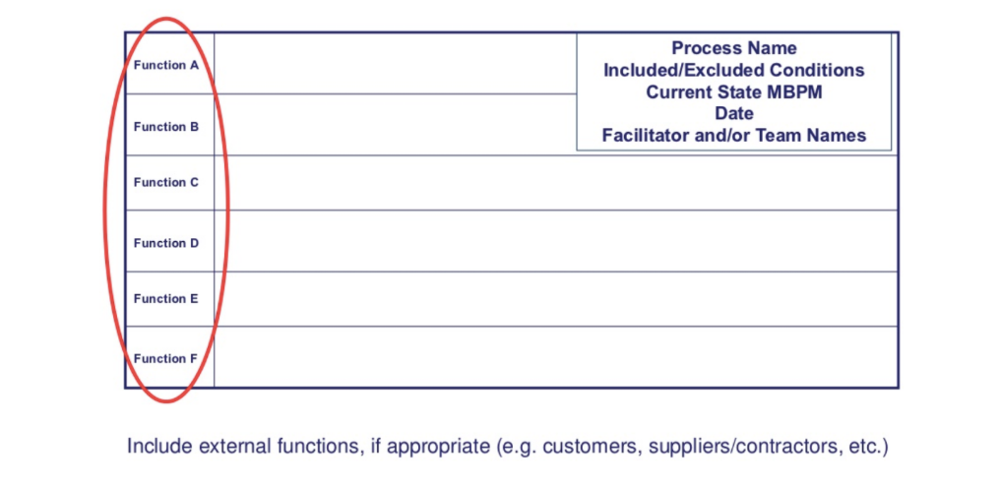 <!-- {.element: class="inline-image"} -->
* What will you call your MBPM diagram?
* Who/What are your typical functions that do work in your process?

### Exercise - TODO List MBPM

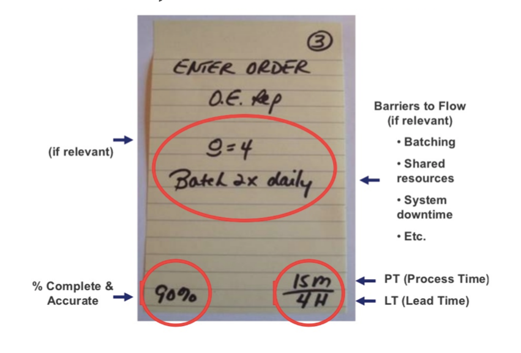 <!-- {.element: class="inline-image"} -->
* PT = The time to actually do the work
* LT = Time from when the work is available until it reaches the next step
* % C&A = Percent of time downstream steps can complete without returning

<!-- .slide: data-background-image="images/chef-background.png", class="white-style" -->
### DevOps practices used in this section:
- [Metric-Based Processing Mapping](https://openpracticelibrary.com/practice/vsm-and-mbpm/)
