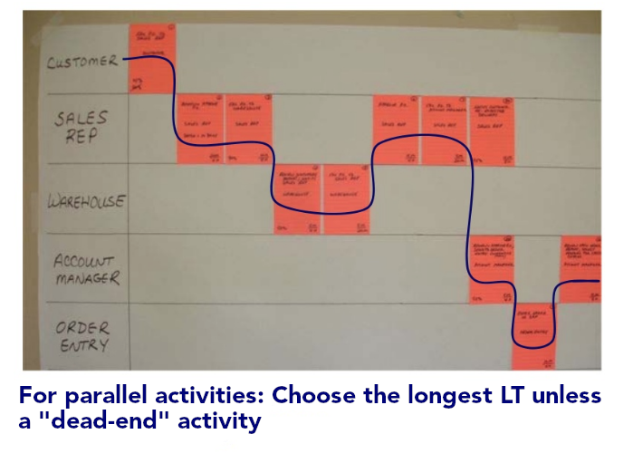
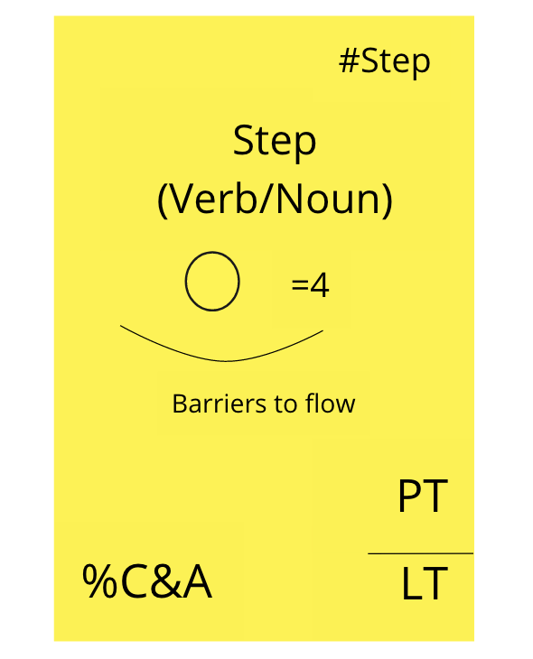

<!-- .slide: data-background-image="images/RH_NewBrand_Background.png" -->
## DevOps Culture and Practice <!-- {.element: class="course-title"} -->
### Metric-Based Process Mapping <!-- {.element: class="title-color"} -->
TL500 <!-- {.element: class="title-color"} -->

### Batch Processing
#### _What is it?_
* Concurrent work being done
* Typically performed on a schedule or specific timeframe

#### _How can it be used?_
* Help identify Work In Progress limits
* Show flow of work through the team/system

#### [The Penny Game](https://www.leanagiletraining.com/better-agile/agile-penny-game-rules/)
1. Break out into teams and experiment with batch processing using poker chips.
2. Follow the facilitator's instructions.

  <h2>Open Practice Library</h2>
  

  <h2>Metric-Based Process Mapping</h2>
  

### Value Streams 
Each table picks a sector and a business use case (some examples below):
* **Telco** - Ordering a new Broadband package
* **Finance** - Creating new Current Account
* **Government** - Paying for Council Tax
* **Energy** - Switching energy provider

#### Some questions to lead the discussions ...
What is the trigger for the stream?
What is end business value?
What are all the steps in between?
What's the Technology or system that helps with that step?

_DevOps is focused on speeding up that value chain. Metric-Based Process Mapping (MBPM) is a practice that will help visualize all these steps and capture some metrics about how long they take._

### Metric-Based Process Mapping

#### MBPM - Pet Battle <!-- .element: class="title-bottom-left" -->
<!-- .slide: data-background-size="contain" data-background-image="images/mbpm/example-pb.png", class="white-style" -->

#### _What is it?_
* A detailed process mapping practice that captures process steps, responsible actors, and key time and quality metrics.
* Heavily influenced by Karen Martin's work in this area.
* Designed to view the detailed, micro picture and make tactical improvements with front line workers.

<!-- .element: class="image-no-shadow " -->
<!--
It is a third generation lean process improvement techniques, optimizable for an extended organizational transformation effort.
The first generation comes from Toyota's "information and material flow" as documented in Lean Thinking.
The second generation from Learning to See.
-->

#### _Why use it?_
* Holistically analyze and optimize "brownfield" delivery processes, including everything from requirements definition, infrastructure provisioning and application development.
* Visually represent the way work flows through an organization
* Building a shared understanding throughout the various levels of an organization
how the work is actually done.
* Formulating specific, data driven improvement plans.

### Metrics of Velocity
<!-- {.element: class="" style="border:none; box-shadow:none; height:200px; float:left;"} -->

* Frequency of deployments (more frequent is better)
* Lead time for new features: from ideation through delivery (shorter is better)
* Frequency of change failures (fewer changes are better)
* Mean-time-to-repair, MTTR (shorter recovery times are better)

<!-- .element: class="image-no-shadow image-full-width " -->

#### Flow Metrics
* **Throughput** — the number of work items finished per unit of time
* **Work in progress (WIP)** — the number of work items started but not finished. The team can use the WIP metric to provide transparency about their progress towards reducing their WIP and improving their flow
* **Cycle Time** — the amount of elapsed time between when a work item starts and when a work item finishes.
* **Work Item Age** — the amount of time between when a work item started and the current time. This applies only to items that are still in progress.

### Metric-Based Process Mapping
How To ...

  
 
    <h4>Create the swimlanes</h4>
    
  

  
 
    <h4>Add activities / steps over time</h4>
    
  

  
 
    <h4>Some activities / steps could be in parallel</h4>  
    
  

### Metric-Based Process Mapping
Document all activities / steps (the things)

  
 
    <h4>The Activity</h4>
    
  

  
 
    <h4>Name the activity and who's involved</h4>
    
  

  
 
    <h4>Add the number of people</h4>  
    
  

  
 
    <h4>Add the accuracy</h4>  
    
  

  
 
    <h4>Process Time / Lead Time</h4>  
    
  

  
 
    <h4>The time spent doing the activity</h4>
    
  

  
 
    <h4>Lead Time includes Process Time</h4>
    
  

  
 
    <h4>Lead Time includes Process Time and all other delays</h4>  
    
  

#### Define the _Timeline Critical Path_
<!-- .element: class="image-no-shadow image-full-screen" -->

#### Summary of the steps
1. Label the map and create Swim Lanes
2. Add time
3. Add the activities (the steps) to the map (some could be in parallel)
4. Document all the activities (the steps). On each sticky note track the activity
   * Name the activity and who's involved
   * Add the number of people
   * Add the Accuracy (% complete and accurate)
   * Add process / Lead Time

### What to do next?
* Identify handoffs
* Create summary metrics
* Identify improvement areas
* Validate the improvements with a future state MBPM

### Exercise 
#### As a class:
1. Walk through the *as-was* MBPM

<!-- .slide: data-background-size="contain" data-background-image="images/mbpm/pb-as-was.png", class="white-style" -->

#### In your team
 <!-- {.element: class="inline-image"} -->
1. Identify improvements on the steps and if it's possible to reduce handover or remove any of the existing steps.
2. Document any new activities (the steps). On each sticky note track the activity:
     * Name the activity and who's involved
     * Add the number of people
     * Add the Accuracy (% complete and accurate)
     * Add process / Lead Time

### Real World Examples

<!-- .slide: data-background-size="contain" data-background-image="images/mbpm/mbpm-cars1.png", class="white-style" -->

<!-- .slide: data-background-size="contain" data-background-image="images/mbpm/mbpm-cars2.png", class="white-style" -->

<!-- .slide: data-background-size="contain" data-background-image="images/mbpm/mbpm-cars3.png", class="white-style" -->

<!-- .slide: data-background-size="contain" data-background-image="images/mbpm/metrics-car-co.png", class="white-style" -->

<!-- .slide: data-background-size="contain" data-background-image="images/mbpm/pelorus.png", class="white-style" -->

### Facilitation Tips
* You can map the MBPM steps with the Big Picture flow and improvements for a better visualisation of work
* Use a spreadsheet to calculate numbers for metrics, it will be much easier to do it
* Iterate Iterate Iterate! Start with small teams and compare over and over again
* If psychological safety is low, postpone gathering the numbers until trust there
  * Tools with numbers on them can be very intimidating to people
* Don't be too specific about the numbers, just use them as a gauge. It's not about the seconds it's bigger than that

<!-- .slide: data-background-image="images/chef-background.png", class="white-style" -->
### Related and Used practices
Related practices:

* [Value Stream Mapping](https://openpracticelibrary.com/practices/vsm-mbpm)
* [Value Stream Mapping](https://openpracticelibrary.com/practices/value-slicing)
* [Team Topologies](https://teamtopologies.com)

There are other practices in the space of  working on how we might start building a solution that fixes problems or realize some new opportunities:

* [Emerging Architecture](https://openpracticelibrary.com/)
* [NFR Map](https://openpracticelibrary.com/practices/non-functional-requirements-mapping)
* [Event Storming](https://openpracticelibrary.com/practices/event-storming)
