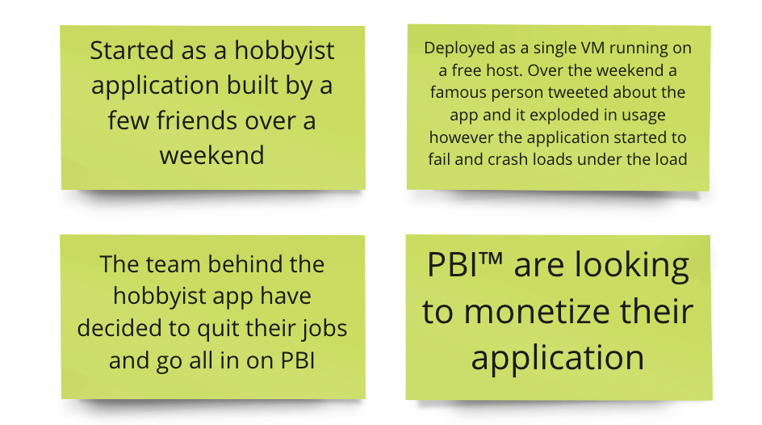

<!-- .slide: data-background-image="images/RH_NewBrand_Background.png" -->
### DevOps Culture and Practice <!-- {_class="course-title"} -->
## Non Functional Requirements Map <!-- {_class="title-color"} -->
TL500 <!-- {_class="title-color"} -->

  <h2>Open Practice Library</h2>
  

  <h2>NFR Map</h2>
  

##### NFR Map - World Health Organisation <!-- .element: class="title-bottom-left" -->
<!-- .slide: data-background-size="contain" data-background-image="images/nfr-map/example-who-nfr-map.png", class="white-style" -->

#### _What is it?_
A tool to capture and articulate the non-functional requirements of a solution that a team are striving to deliver

 

<!-- .element: class="image-no-shadow image-full-width" -->
<!--  
#### _What is it?_
* Aims to elaborate non-functional areas that are unlikely to be captured using practices primarily focused on functional aspects of a solution.
* Non-functional requirements are broken down into areas represented by each segment on the canvas.
* Findings and learnings from other Discovery practices can be input into this practice if appropriate.
-->

#### Why do we use it?
* To gain a shared understanding of non-functional aspects of a system in a visually structured representation. 

* On completion you should have a good view on the key non-functional considerations for the solution and where work is required to realise these.
<!--
--->

## How do we do it?
<!-- .slide: data-background-size="contain" data-background-image="https://openpracticelibrary.com/images/non-functional-requirements-map.jpg", class="black-style" -->

#### How do we do it?
1. Ensure that everyone participating is comfortable with the headings and what they mean <!-- .element: class="fragment" -->
2. For each heading, capture on stickies important considerations or requirements for the system or solution. Depending on the number of participants, you could use facilitation techniques such as 1-2-4-all or splitting into smaller groups to capture items <!-- .element: class="fragment" -->
<!-- .slide: data-background-size="contain" data-background-image="https://openpracticelibrary.com/images/non-functional-requirements-map.jpg", class="black-style" style: opacity: 0.5; -->

#### How do we do it?
3. For each heading, play back the stickies as a group
4. During the playback, think about whether each sticky should be:

<!-- .element: class="image-no-shadow image-full-width" -->

<!-- .element: style="width: 75%" -->
   

1. Ensure that everyone participating is comfortable with the headings and what they mean
2. For each heading, capture on stickies important considerations or requirements for the system or solution. Depending on the number of participants, you could use facilitation techniques such as 1-2-4-all or splitting into smaller groups to capture items

  
  
  
  
  
  

#### Impact Map - World Health Organisation <!-- .element: class="title-bottom-left" -->
<!-- .slide: data-background-size="contain" data-background-image="images/ImpactMapping/example-who.png", class="white-style" -->

### Class Exercise - Setting the Scene

#### Setting the Scene: Pet Battle Industries
A silly app that allows users to upload pictures of their 🐈 or 🐕 and enter them into a competition.
<!-- .element: class="image-no-shadow" -->
<!-- 
* Started as a hobbyist application built by a few friends over a weekend
* Deployed as a single VM running on a free host. Over the weekend a famous person tweeted about the app and it exploded in usage however the application started to fail and crash loads under the load
* The team behind the hobbyist app have decided to quit their jobs and go all in on PBI&trade;
* PBI&trade; are looking to monetize their application
-->

### The Goal & Actors
#### *As a class:*

1. The _`Goal`_ - Is this a good goal?
   * _Generate 100K in revenue with our new & existing customer base by the end of the year_
  
2. The _`Actors`_ - Diverge <> Converge:
   * Who are the **all** the actors that can get us to our goal?
   * Who are the focus ones? Pick one to two actors per table

### The Impacts
#### *As a class:*
1. Walk through creating the _`Impacts`_ for one _`Actor`_

#### *In your team:*
1. Determine _`Impacts`_ for your _`Actors`_

### The Deliverables & Voting
#### *In your team:*
1. Determine some _`Deliverables`_ for the _`Impacts`_ on your _`Actors`_
2. Issue your Donal Dollars&trade; and place your bets on the _`Impacts`_

# Exercise Wrap Up

[PetBattle Miro Board](https://app.mural.co/t/warhw2023/m/warhw2023/1580744046908/05e98ef35312102d27aa494ff5e92b4ecb1ecc17?sender=dspring0331)

#### Impact Map - Pet Battle <!-- .element: class="title-bottom-left" -->
<!-- .slide: data-background-size="contain" data-background-image="images/ImpactMapping/pb-full-example.png", class="white-style" -->

#### Facilitation Tips

* Don't spend too long on the goal - get it good enough and move on
* Have a goal preprepared in advance to really speed up teh workshop
* If time is a constraint, forget about deliverables and focus just on the impacts
 

#### Tips For Remote
* Break the practice into many sessions
* Use breakout rooms to ideate in smaller size
* Don't rely on the facilitator alone to update the board

<!-- .slide: data-background-image="images/chef-background.png", class="white-style" -->
### Related Practices
- [Start at the End](https://openpracticelibrary.com/practice/start-at-the-end/) - a simple exercise to identify a set of assumptions which must be tested in order achieve a long term goal
