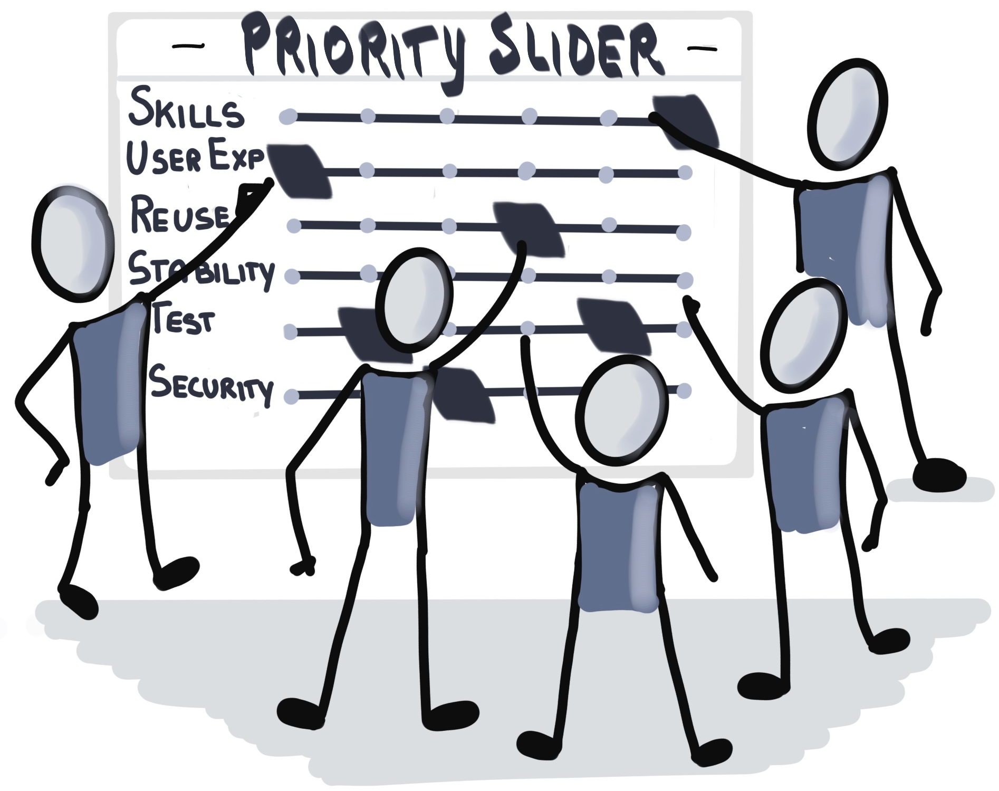

<!-- .slide: data-background-image="images/RH_NewBrand_Background.png" -->
## DevOps Culture and Practice <!-- {.element: class="course-title"} -->
### Priority Sliders (Trade Off Sliders)<!-- {.element: class="title-color"} -->
TL500 <!-- {.element: class="title-color"} -->

<!-- .slide: data-background-size="stretch" data-background-image="images/opl-logo.png", class="white-style" -->

  <h2>Open Practice Library</h2>
  

  <h2>Priority Sliders</h2>
  

  <h2>Priority Sliders</h2>
  

#### <!-- .element: class="title-bottom-left" -->
<!-- .slide: data-background-size="contain" data-background-image="images/priority-sliders/example-who.png", class="white-style" -->

#### _What is it?_
_Priority Sliders are a visual tool for getting teams to agree which work items are the most important by trading one item against another on a scale from <strong>least</strong> to <strong>most</strong> important_

 <!-- .element: style="max-width: 60%;" -->

### Effective Priority Sliders

<!-- .element: class="image-no-shadow image-full-width" -->
<!-- 
- Used to validate what items should be done next when there are debates
- Publicly displayed
- A finite set of topics/dimensions/areas that can be relatively prioritized against each other
-->

### Why use Priority Sliders?
_A practice that increases the autonomy of teams_
- Enables an alignment and consensus on areas of focus
- Projects often involve trade offs, agreement is key
- Provides clarifications across stakeholder groups of motivations and desires
- Can be used as a filtering mechanism for later prioritisation and for decision-making

### How do we do it?
<!-- .slide: data-background-size="contain" data-background-image="images/priority-sliders/blank-sliders.png", data-background-opacity="1" -->

### How do we do it?
1. Get a small area of a whiteboard and do some brainstorming around key topics of focus for your engagement. Examples <!-- .element: class="fragment" -->
<!-- .element: class="image-no-shadow image-full-width" -->
2. Introduce the priority sliders canvas, explaining the grid and place the topics as header of the rows <!-- .element: class="fragment" -->
<!-- .slide: data-background-size="contain" data-background-image="images/priority-sliders/blank-sliders.png", data-background-opacity="0.2" -->

### How do we do it?
3. Individually have everyone write down the number of each header as to where they would place it on the scale (~5 min). Once time is up, have everyone put their stickies on the canvas <!-- .element: class="fragment" -->
4. Consider each heading (one by one) and review as a team, having a discussion about alignment. Slide the priorities left to right and drive toward an agreement. There can be no two headings with the same priority! <!-- .element: class="fragment" -->
<!-- .slide: data-background-size="contain" data-background-image="images/priority-sliders/blank-sliders.png", data-background-opacity="0.1" -->

### Exercise - Priority Sliders
In this exercise we will create a priortiy slider canvas for Pet Battle. 
#### *In your team:*
1. Choose roles for the team members to role play: 
   * Head of Architecture
   * Head of Security
   * Head of Business
   * Everyone else is a cross functional team member

### Exercise - Priority Sliders
#### *In your team:*
2. Define the topics that are relevant for Pet Battle use case and place as row headings. 
3. Individually write down the priority number for each heading
4. Try to come to consensus by sliding the priorities against one another.

# Exercise Wrap Up
Q&A  / Feedback

How did you reach consensus?
<!-- .element: class="image-no-shadow image-full-width" -->

#### Facilitation Tips
* Topics are not product features but product area are team-building topics
* Bring to your Sprint Planning: can be used as a filtering mechanism for product backlog items prioritisation
* The Customer team is the one defining priorities
* it's not static - when the work we're doing takes us towards one priority, it may be that things can change. As such, treat this as a dynamic artefact

<!-- .slide: data-background-image="images/chef-background.png", class="white-style" -->
### DevOps practices used in this section:
- [Priority Sliders](https://openpracticelibrary.com/practice/priority-sliders/)

### Related Practices
- [voting](https://openpracticelibrary.com/practice/) - Dot Voting / etc
- Any other prioritization tools eg Impact / Effort Matrix
- Sprint Planning - this practice provides a useful input in the depth of task writing and definition
