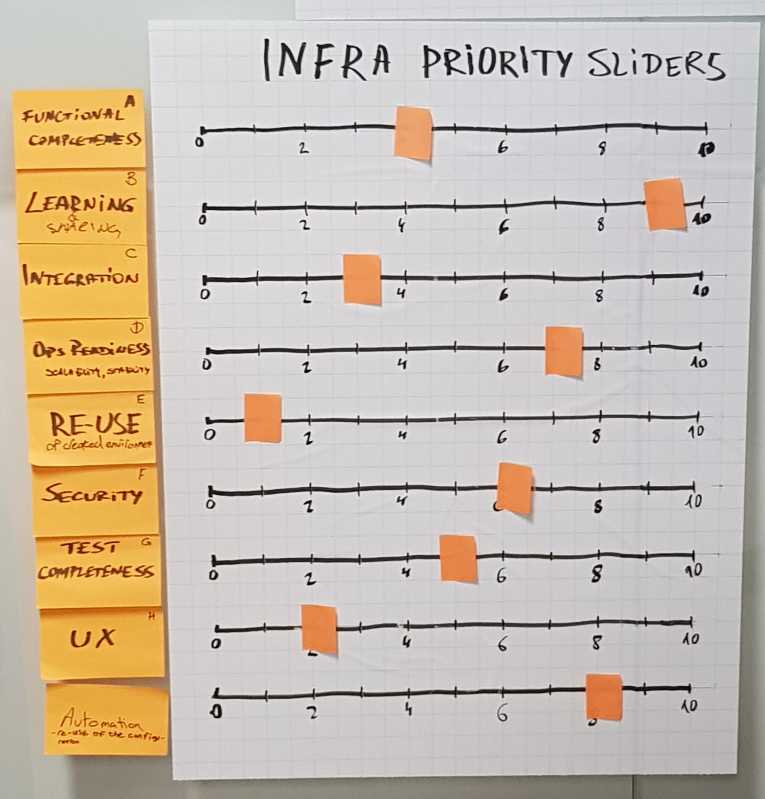

<!-- .slide: data-background-image="images/RH_NewBrand_Background.png" -->
## DevOps Culture and Practice <!-- {.element: class="course-title"} -->
### Priority Sliders <!-- {.element: class="title-color"} -->
TL500 <!-- {.element: class="title-color"} -->

<!--.slide: id="priority-sliders" -->
## What are Priority Sliders?

### Priority Sliders are a visual tool for getting teams to agree which work items are the most important by trading one item against another on a scale from _least_ to _most_ important

### Effective Priority Sliders
 <!-- {.element: class="fragment inline-image"} -->
- Used to validate what items should be done next when there are debates
- Publicly displayed
- A finite set of topics/dimensions/areas that can be relatively prioritized against each other

### Why use Priority Sliders?
- Enables an alignment and consensus on areas of focus
- Projects often involve trade offs, agreement is key
- Provides clarifications across stakeholder groups of motivations and desires

### Exercise - Priority Sliders
 <!-- {.element: class="inline-image"} -->
#### In table groups, work together to:
  1. Draw a 5 heading priority slider chart
  2. Consider the areas identified from Target Outcomes practice
  3. Discuss where you agree as a team the priorities, 1 to 5
  4. Note no priority can be the same level and trade-offs must occur

<!-- .slide: data-background-image="images/chef-background.png", class="white-style" -->
### DevOps practices used in this section:
- [Priority Sliders](https://openpracticelibrary.com/practice/priority-sliders/)
