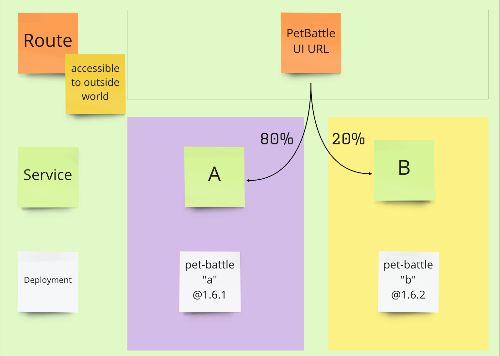

<!-- .slide: data-background-image="images/RH_NewBrand_Background.png" -->
### DevOps Culture and Practice <!-- .element: class="course-title" -->
### Tech Exercise V - The Deployments Strike Back  <!-- .element: class="title-color" -->
### Advanced Deployments & Scalability <!-- .element: class="title-color" -->
TL500 <!-- .element: class="title-color" -->

  <h2>Open Practice Library</h2>
  

  <h2>🚚 Advanced Deployments 📦</h2>
  

### Tech Exercise V
[The Deployments Strike Back](https://starwarsintrocreator.kassellabs.io/?ref=redirect#!/BL_hsikixFsVbDNyZ28h)

##### The Big Picture <!-- .element: class="title-bottom-left" -->
<!-- .slide: data-background-size="contain" data-background-image="https://rht-labs.com/tech-exercise/5-the-deployments-strike-back/images/big-picture-matomo.jpg", class="white-style" -->

#### 🧑‍🏫 Learning outcomes 🧑‍💻
As a learner, by the end of this exercise I ...
* Can enable the Horizontal Pod Autoscaler for my applications
* Can add Blue/Green deployment method into pipeline
* Can run a split test on OpenShift with GitOps - splitting traffic between two tests 
<!--
--->

#### What is it?
Advanced Deployments 🚚📦📦📦👷
* Autoscaling - horizontally scale applications based on observed metrics
* Blue / Green Deployments - release, validate and switch
* A/B Deployments - great for testing new features in small groups. One release with traffic routing between each
  * Don't forget to take measures!!

#### Blue/Green Deployments

  
  

#### Design of Experiments
All our ideas about new products, new services, new feature, any changes we can introduce to make things better (growth, revenue, experience, etc.) start as an idea, a hypothesis, an assumption.

The Design of Experiments is the practice we use to turn ideas, hypothesis and/or assumptions into a concrete well defined set of experiments which can be carried out in order to validate those ideas, hypothesis and assumptions, i.e. provide us with valuable learning.

#### Why do it?
Design of Experiments...
* is a fail safe way to advance a solution and learn fast
* can provide a quick way to evolve a product
* helps drive innovation in existing as well as new products
* enables autonomous team to deliver on leadership intent by placing small bets
* is essential for realising the Build-Measure-Learn loop

#### Split testing
Using the platform to support running an experiment

## Exercise Instructions

### 💥 Choose your own adventure 💥 <!-- .element: class="title-bottom-left" -->
<!-- .slide: data-background-size="contain" data-background-image="images/tech-exercise-v/tasks.png", class="black-style" data-background-opacity="1"	 -->

### 💥 Extend your Kanban 💥 <!-- .element: class="title-bottom-left" -->
<!-- .slide: data-background-size="contain" data-background-image="images/tech-exercise-iii/team-kanban.png", class="black-style" data-background-opacity="1"	 -->

#### 💥 90mins of Tech Exercise 💥
* In mobs / pairs work through your tasks
* If in pairs, continuously playback what you accomplish to the others

# Exercise Wrap Up

#### Design of Experiments - From Value slice <!-- .element: class="title-bottom-left" -->
<!-- .slide: data-background-size="contain" data-background-image="images/tech-exercise-v/pet-battle-experiment.png", class="black-style" data-background-opacity="1"	 -->

#### Design of Experiments - Implementation <!-- .element: class="title-bottom-left" -->
<!-- .slide: data-background-size="contain" data-background-image="images/tech-exercise-v/pet-battle-example.png", class="black-style" data-background-opacity="1"	 -->

#### Design of Experiments - Measure <!-- .element: class="title-bottom-left" -->
<!-- .slide: data-background-size="contain" data-background-image="images/tech-exercise-v/pet-battle-matomo.png", class="black-style" data-background-opacity="1"	 -->

<!-- .slide: data-background-image="images/chef-background.png", class="white-style" -->
### Related & Used Practices
- [Lean UX](https://openpracticelibrary.com/)
- [Split Testing](https://openpracticelibrary.com/)
- [Dark Launches](https://openpracticelibrary.com/)
- [Feature Toggling](https://openpracticelibrary.com/)
