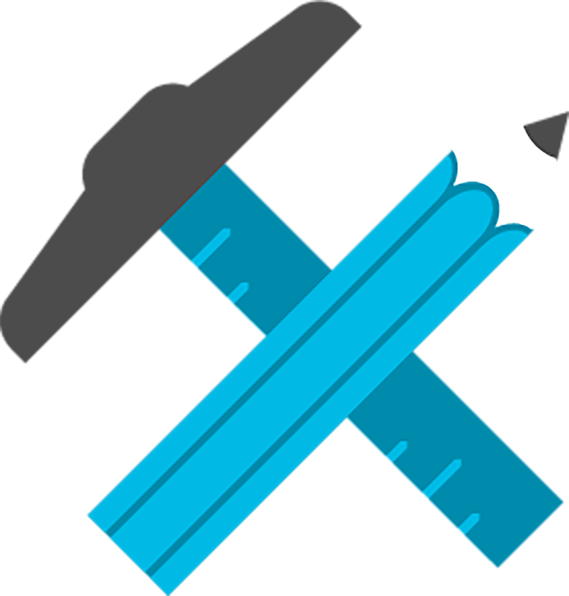
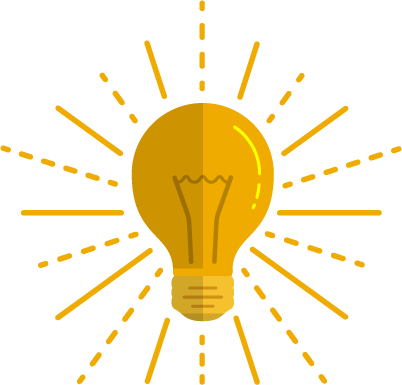
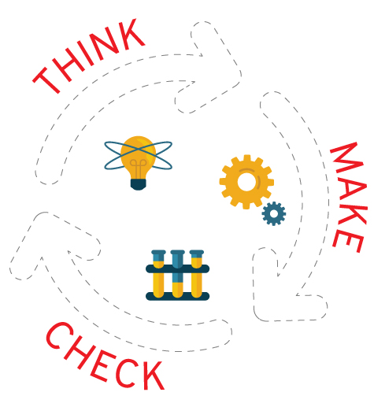
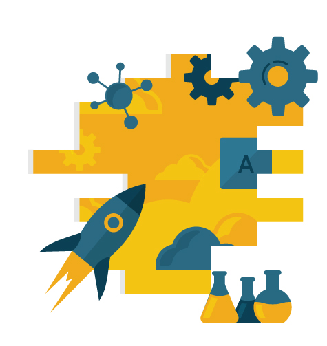

<!-- .slide: data-background-image="images/RH_NewBrand_Background.png"  -->
## DevOps Culture and Practice <!-- {.element: class="course-title"} -->
### UX <!-- {.element: class="title-color"} -->
TL500 <!-- {.element: class="title-color"} -->

### Exercise - Do you know what is....

 <!-- {.element: class="" style="border:none; box-shadow:none;"} -->

 <!-- {.element: class="" style="border:none; box-shadow:none; height:100px; float:left; margin-left:100px;"} -->
1. Break out into teams and research a topic [5mins]
2. Generate a presentation with graphic [5mins]
3. Playback your findings [3mins]

<!-- .slide: data-background-size="stretch" data-background-image="images/opl-logo.png", class="white-style" -->

  <h2>Open Practice Library</h2>
  

  <h2>Lean UX / Empathy Mapping</h2>
  

  <h2>Lean UX / Empathy Mapping</h2>
  

#### Foundation or Discovery?
_You can use Empathy Mapping at various times in the product lifecycle_

We use empathy maps during the facilitation of product discovery, user research, getting early feedback on conceptual design, prototypes, and visual designs. It can also be used to capture feedback regarding the user testing of developed application features.

### Pop Quiz

 <!-- {.element: class="" style="border:none; box-shadow:none; height:300px; float:left;"} -->

The main responsibility of a UX designer is to create nice looking user interfaces?
<!-- {.element: class="" style="margin-top: 120px;"} -->

TRUE  **or** FALSE

### Pop Quiz

 <!-- {.element: class="" style="border:none; box-shadow:none; height:300px; float:left;"} -->

I’m a designer.
<!-- {.element: class="" style="margin-top: 120px;"} -->

**No**, I don’t just make things pretty.

<!-- .slide: data-background-image="images/ux/iceberg.jpg", class="white-style" -->

### Empathy Mapping

<!-- .slide: data-background-size="contain" data-background-image="images/ux/example-dev-ops.png", class="white-style" -->

#### _What is it?_
* A tool to capture and visualize what key stakeholders are sensing when in a
particular context or completing a set of tasks
* A way to form a better understanding of users and build personas
* Information is captured directly from interviews, observations, and other
facilitated conversation exercises
* Senses captured can include what the person is seeing, thinking, doing, and feeling
* Originated from Dave Gray of [XPLANE](http://www.xplane.com/)

#### _Why use it?_
* Captures information and learning directly from the end user affected by the
system/application/solution in question
* Enables a direct connection between important stakeholders and developers, e.g.
developers of an application can learn directly from end users using it
* The tool identifies pain points, opportunities, and starts to form a basis for
improvement and optimization
* The tool can be used to move from user empathy to value propositions

<!-- .slide: data-background-image="images/ux/empathy-map.jpg", class="white-style" -->

<!-- .slide: data-background-image="images/ux/empathy-map.jpg", class="black-style" data-background-opacity="0.15"-->
#### _How do we do it?_
1. Different colour stickies may be used for positive/negative feedback from the user
2. The moderator will ask the user prompting questions, while the group will capture the feedback
3. The "See" quadrant will contain what your user encounters in their daily experiences (people, activities, things)
4. "Say & Do" may include information around the tasks they undertake and how they describe or convay these tasks to their team

<!-- .slide: data-background-image="images/ux/empathy-map.jpg", class="black-style" data-background-opacity="0.15"-->
#### _How do we do it?_
5. "Hear" outlines what the user is hearing and how it may influence them (family, friends, media, coworkers)
6. "Think & Feel" what feelings are invoked? Consider positive and negative. What worries them? What are they lacking? What thoughts are triggered?
7. Pains & Gains - What does success and failure look like? Capture the obstacles and aspirations
8. Cluster collaboratively similar notes within the same quadrants, theme and discuss - the team should gain a shared understanding of the user

### **GREAT NEWS!**
<!-- .slide: data-background-image="images/ux/empathy-map.jpg", class="black-style" data-background-opacity="0.2"-->
 <!-- {.element: class="" style="border:none; box-shadow:none; height:200px; float:left;"} -->

MORNING ROUTINE VENTURES™️ <!-- {.element: class="" style="margin-top: 100px; text-align:left;"} -->
Wants to invest in the ‘people that are late for work market’!

**BIG OPPORTUNITY !** 

### Exercise

 <!-- {.element: class="" style="border:none; box-shadow:none; height:300px; float:right;"} -->

Invent a product based on your value slicing excercise information.  <!-- {.element: class="" style="width:500px;"} -->

* **Step 1** - User Interview [5 mins]
* **Step 2** - Sketch - Prototype [10 mins]
* **Step 3** - User Testing [5 mins]
* **Step 4** - Build with Lego [15 mins]

Quick Tips - Use an empathy map, Ask 5 ladder technique: WHY?WHY?WHY?WHY?WHY?
<!--{.element: class="" style="text-align:left; font-size: smaller; font-weight: 100;"} -->

### User interview - useful tips

* Well crafted open questions - Ask question which assist the interviewee to tell a story,  avoid binary questions (questions which can be answered by yes/no)

 *e.g. <s>Do you like...?</s> What do you like about...?*
* Dig deeper, follow up:

 *e.g. you mentioned it was hard, tell me more about why...*
* Ask 'why', try to keep the conversation flowing
* Embrace the awkward silence - Silence is good, it gives the interviewee time to reflect on what they have said
* Do not use jargon
 <!-- {.element: class="" style="border:none; box-shadow:none; height:150px; float:right; margin-left:200px;"} -->
* Keep your reaction neutral
* Do not mention the solution until the end
* Inconsistencies can lead to interesting insights

### **TEAM PRESENTATIONS**
 <!-- {.element: class="" style="border:none; box-shadow:none; height:350px; float:left; margin-left:100px;""} -->

* Initial Idea<!-- {.element: class="" style="margin-top: 120px; text-align:left;"} -->
* User Interview
* Product
* User Feedback
* Learnings & Future Plans

#### Empathy Map - Dev and Ops <!-- .element: class="title-bottom-left" -->
<!-- .slide: data-background-size="contain" data-background-image="images/ux/example-dev-ops.png", class="white-style" -->

#### Empathy Map - Pet Battle <!-- .element: class="title-bottom-left" -->
<!-- .slide: data-background-size="contain" data-background-image="images/ux/example-pb.png", class="white-style" -->

#### User Interviews - WHO <!-- .element: class="title-bottom-left" -->
<!-- .slide: data-background-size="contain" data-background-image="images/ux/who-personas.png", class="white-style" -->

<!-- .slide: data-background-image="images/chef-background.png", class="white-style" -->
### Related & Used Practices
#### Technical Practices:
- [Blue Green deployments](https://openpracticelibrary.com/practice/blue-green-deployments/)
- [Split Testing or A/B Tests](https://openpracticelibrary.com/practice/split-testing-a-b-testing/)

#### Human Centered Design Practices: 
- [Empathy Mapping](https://openpracticelibrary.com/practice/empathy-mapping/)
- [AEIOU Observation Framework](openpracticelibrary.com/practice/aeiou-observation-framework/)
- [Proto Persona](openpracticelibrary.com/practice/proto-persona)
- [Stakeholders Interview](openpracticelibrary.com/practice/stakeholders-interview)
- [Empathy Mapping](openpracticelibrary.com/practice/empathy-mapping)
- [Lean UX Workshop](openpracticelibrary.com/practice/lean-ux-workshop)
- [UI Design Workshop](openpracticelibrary.com/practice/ui-design-workshop)
